# Authentication Flow Diagrams

This document contains sequence diagrams for all authentication flows in the system.

## 1. Sign Up Flow (New User)

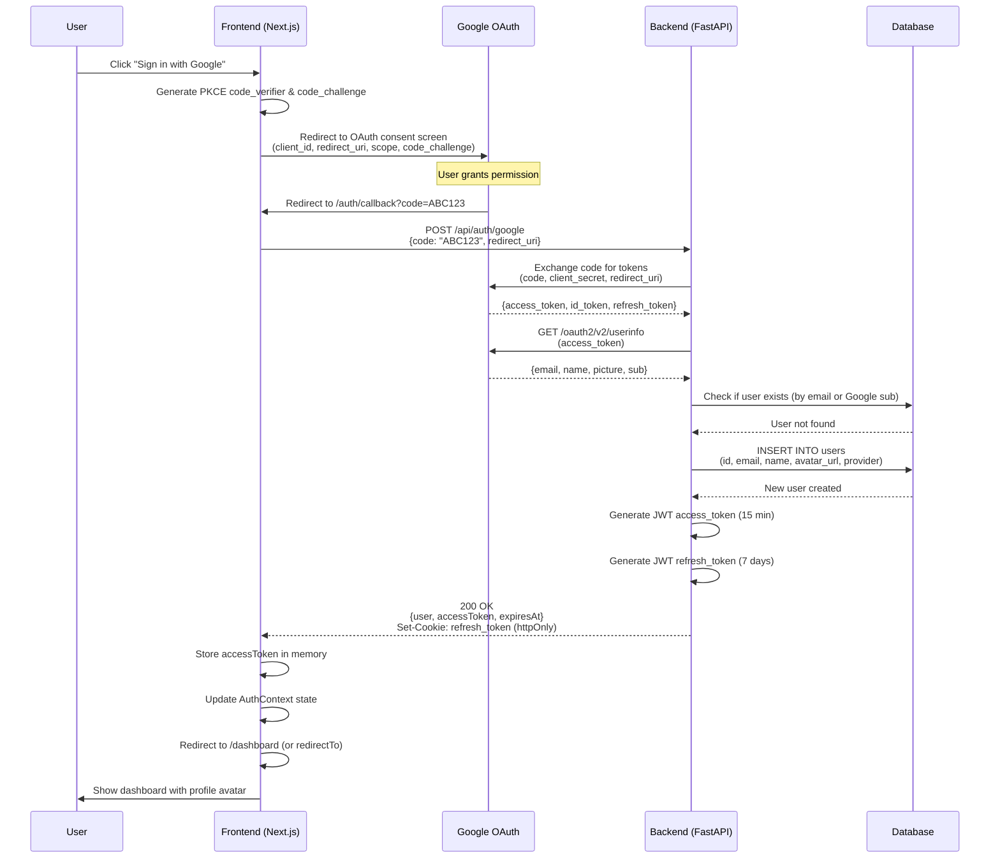

---

## 2. Sign In Flow (Existing User)

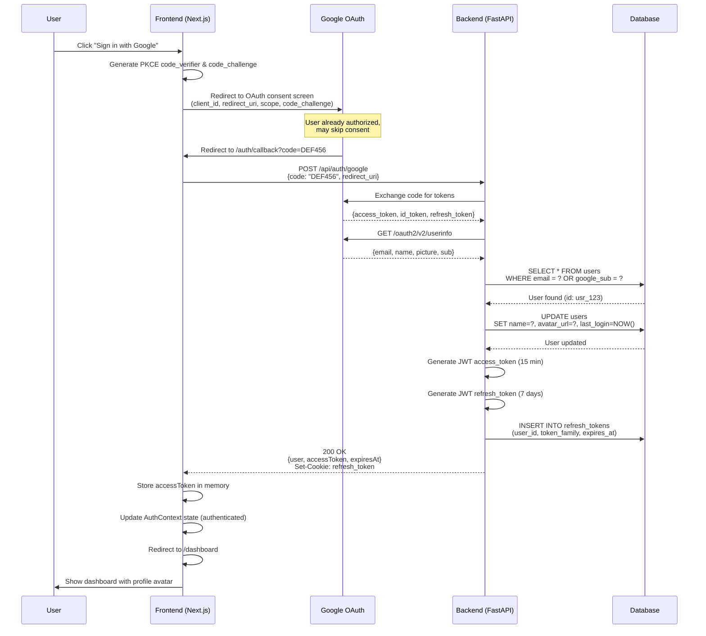

---

## 3. Token Refresh Flow

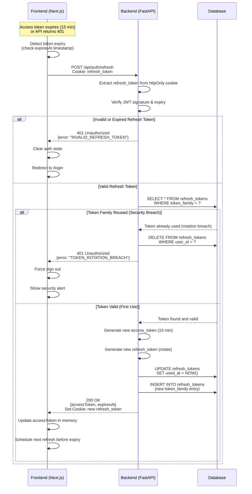

---

## 4. Sign Out Flow

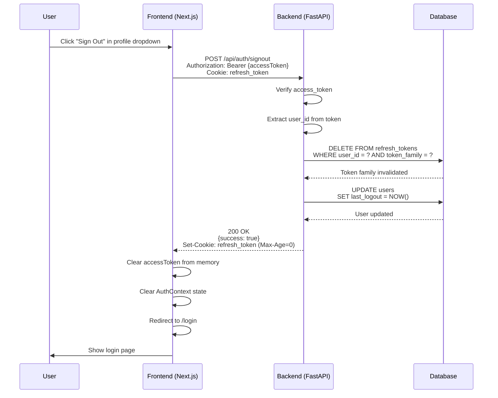

---

## 5. Protected Route Access (Authorized)

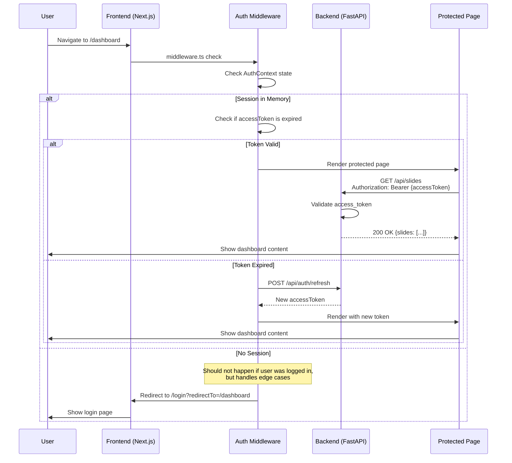

---

## 6. Protected Route Redirect (Unauthorized)

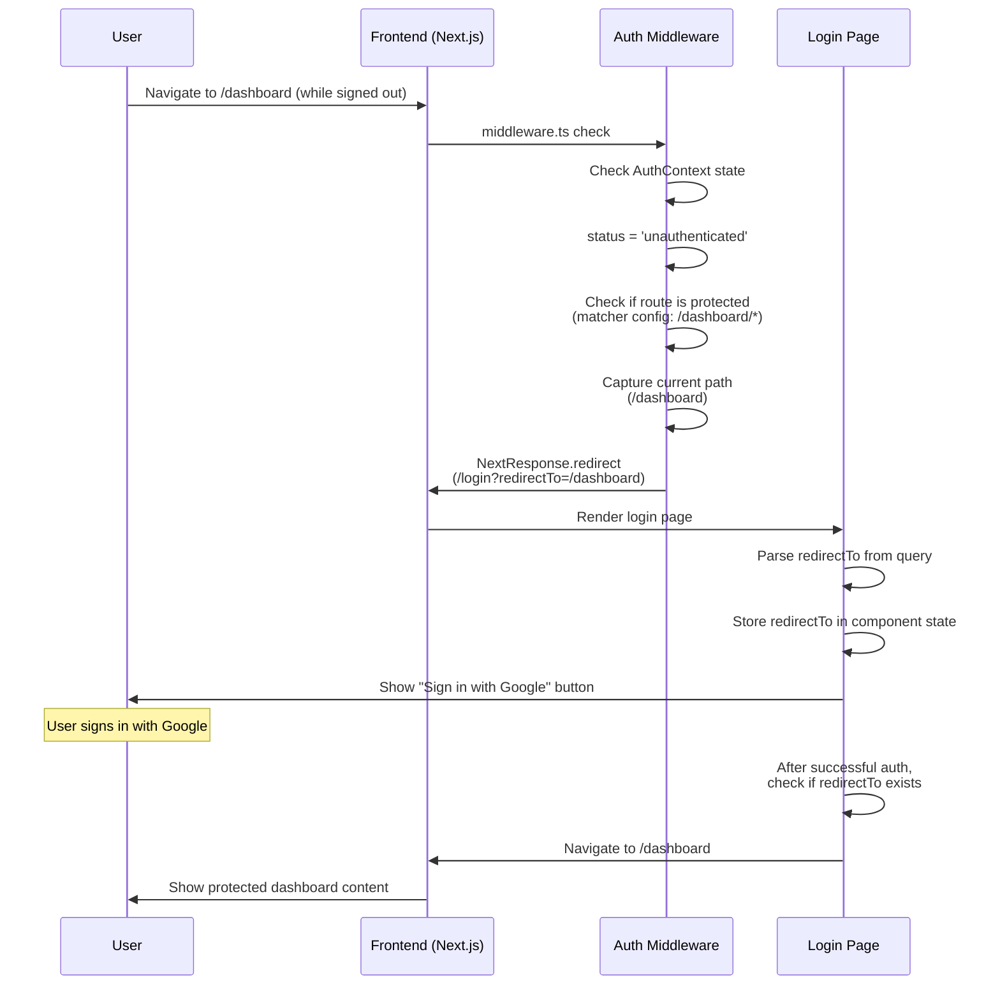

---

## 7. Session Initialization on App Load

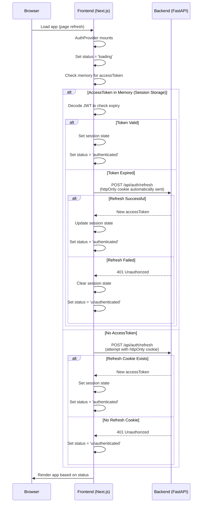

---

## 8. Automatic Token Refresh (Background)

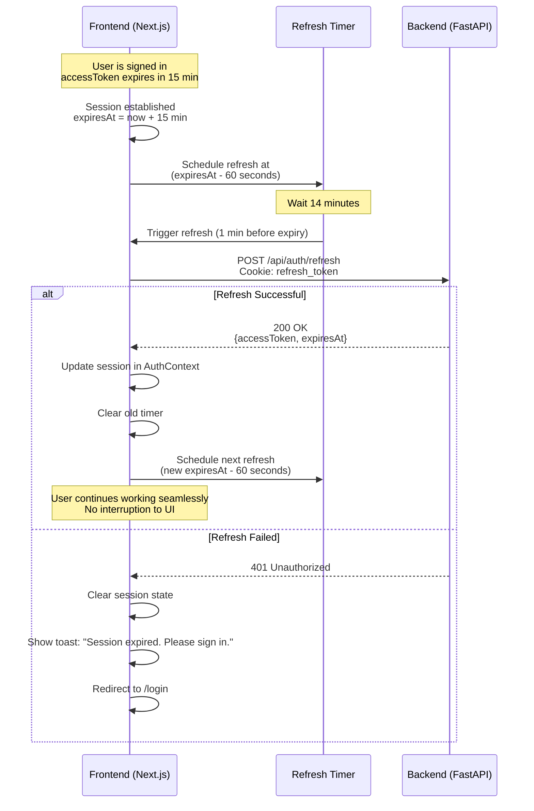

---

## 9. API Request with Auto-Refresh on 401

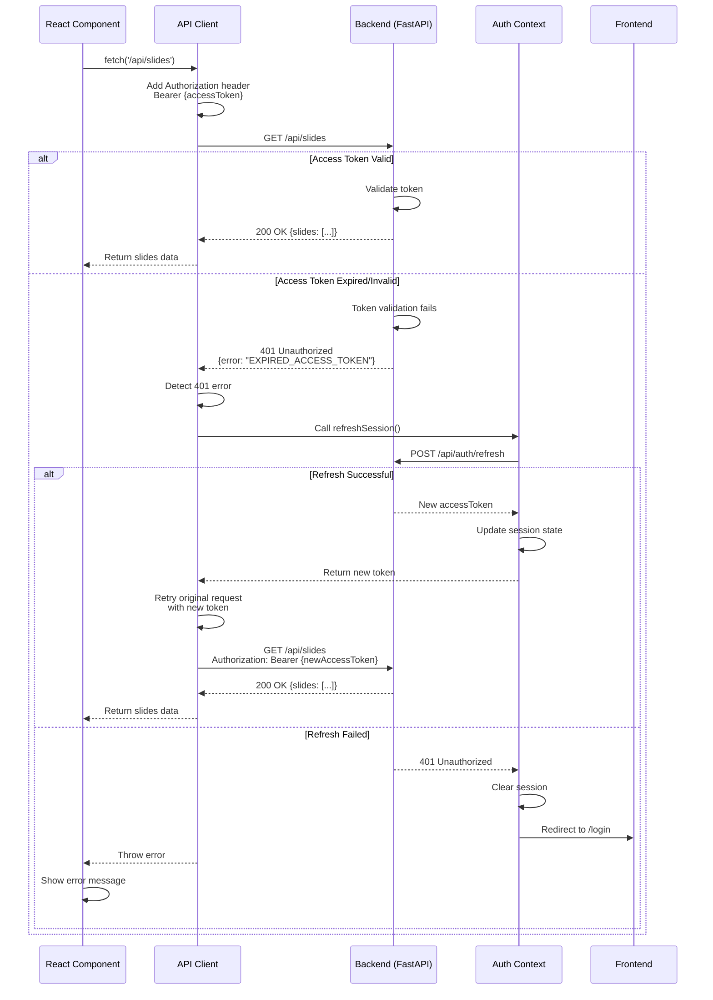

---

## 10. Error Recovery - Network Failure

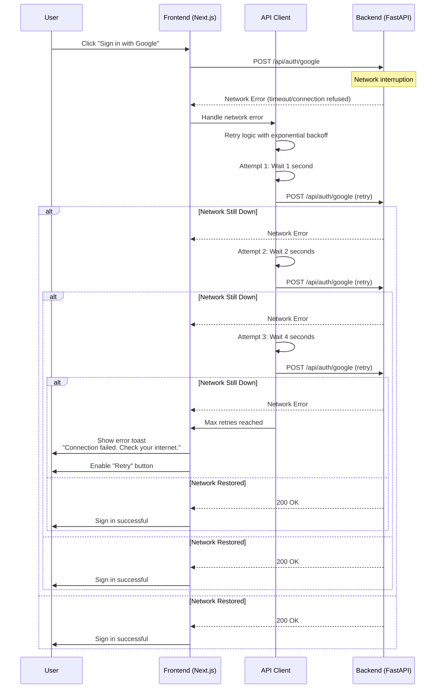

---

## 11. Multi-Tab Synchronization

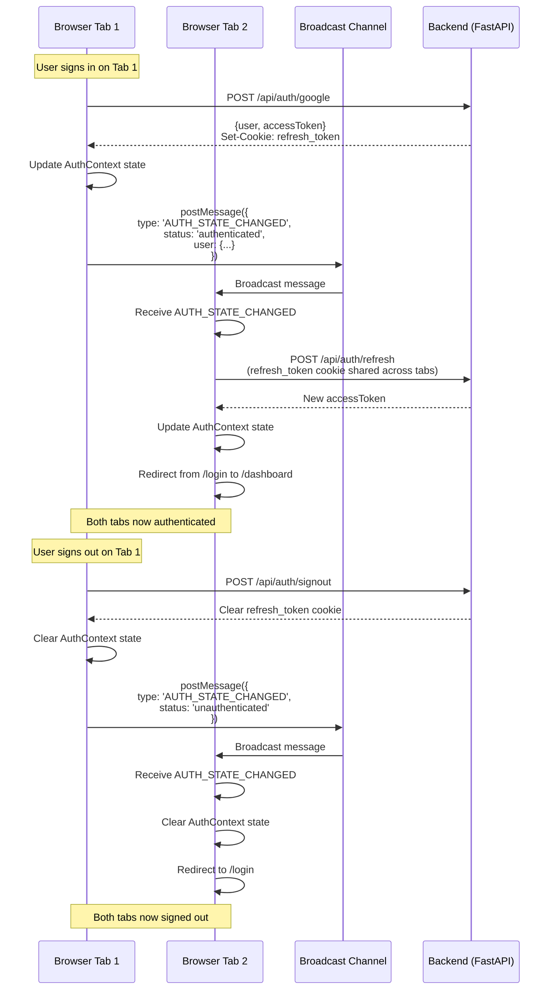

---

## Flow Summary

| Flow | Actors | Key Steps | Duration |
|------|--------|-----------|----------|
| **Sign Up** | User, Frontend, Google, Backend, DB | OAuth consent → Token exchange → Create user → Generate JWT | ~3-5 seconds |
| **Sign In** | User, Frontend, Google, Backend, DB | OAuth consent → Token exchange → Update user → Generate JWT | ~2-4 seconds |
| **Token Refresh** | Frontend, Backend, DB | Validate refresh token → Rotate tokens → Return new access token | ~100-200ms |
| **Sign Out** | User, Frontend, Backend, DB | Invalidate tokens → Clear cookies → Clear state | ~50-100ms |
| **Protected Route (Auth)** | User, Frontend, Middleware, Page | Check session → Render page → Fetch data | ~10-50ms (client-side) |
| **Protected Route (Unauth)** | User, Frontend, Middleware | Check session → Redirect to login → Capture redirect path | ~10-20ms (client-side) |
| **Session Init** | Browser, Frontend, Backend | Check memory → Attempt refresh → Set status | ~200-500ms |
| **Auto-Refresh** | Frontend, Timer, Backend | Schedule timer → Refresh before expiry → Update session | ~100-200ms (background) |
| **API with Retry** | Component, APIClient, Backend | Request → 401 error → Auto-refresh → Retry | ~300-400ms |
| **Error Recovery** | User, Frontend, Backend | Network error → Exponential backoff → Retry → Show error | ~7-15 seconds (max) |
| **Multi-Tab Sync** | Tab1, Tab2, BroadcastChannel | Auth change → Broadcast → Sync state | ~10-50ms |

---

**Document Version**: 1.0.0
**Last Updated**: 2025-11-09
**Authors**: Auth Architect Agent
**Status**: Draft for Review
