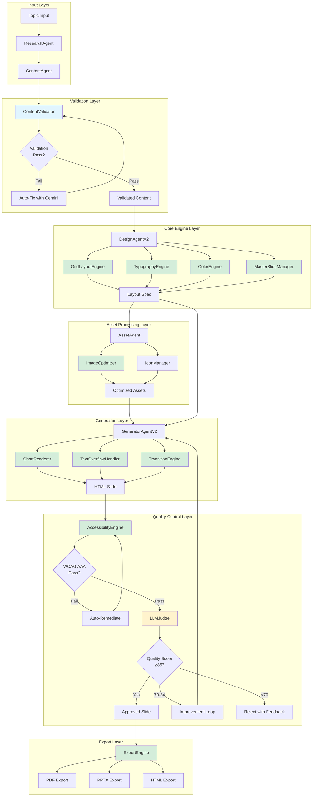
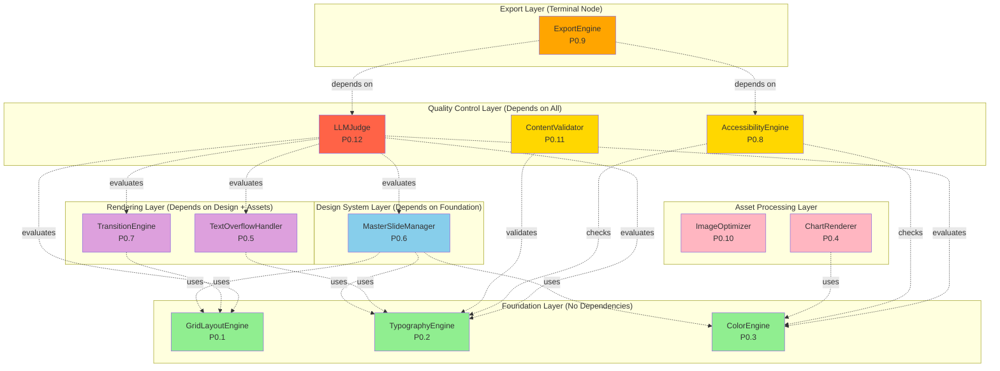
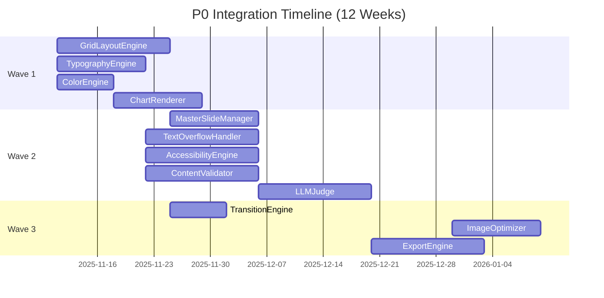
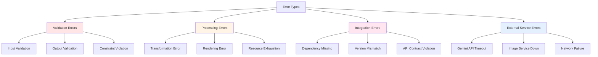
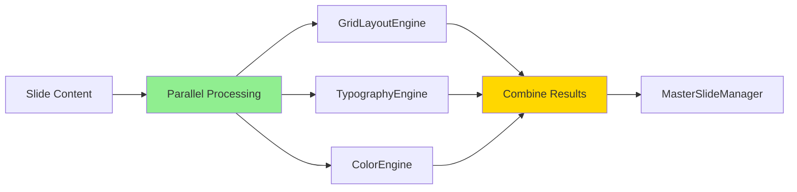
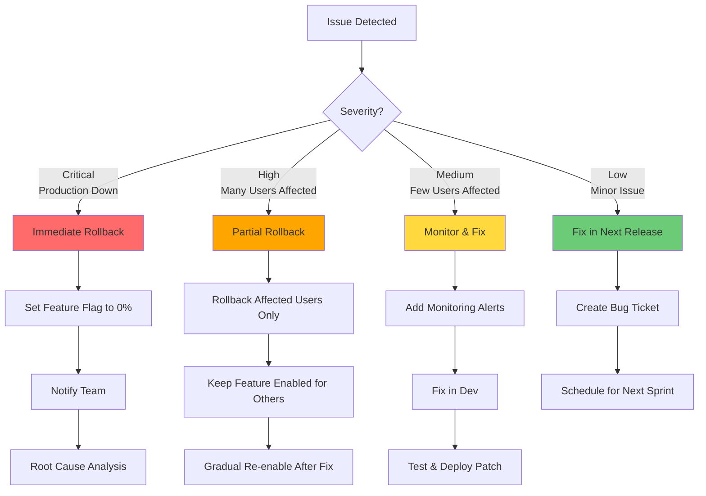
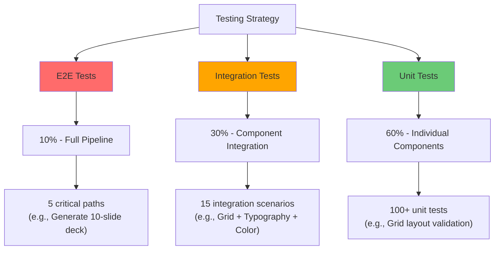
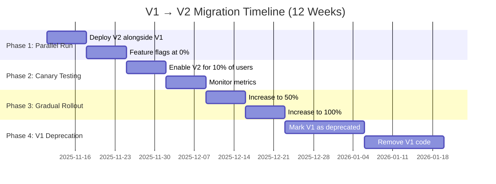

# P0 Integration Architecture Design

**Document Version:** 1.0
**Date:** 2025-11-08
**Status:** Technical Specification
**Architect:** System Architecture Designer
**Project:** Slide Designer P0 Feature Integration

---

## EXECUTIVE SUMMARY

This document defines the comprehensive integration architecture for the 12 P0 (Priority 0) must-have features of the Slide Designer system. It provides detailed system architecture diagrams, dependency mappings, API contracts, error handling strategies, performance optimization plans, and rollback procedures.

**Objectives:**
- Ensure seamless integration of all 12 P0 features
- Define clear boundaries and contracts between components
- Establish robust error handling and recovery mechanisms
- Optimize for performance, scalability, and maintainability
- Enable safe rollback procedures for failed integrations

**Timeline:** 12 weeks across 3 implementation waves
**Risk Level:** Medium (managed through phased rollout)
**Success Criteria:** 95%+ quality score, <2s per-slide latency, zero breaking changes to V1 API

---

## TABLE OF CONTENTS

1. [System Architecture Overview](#1-system-architecture-overview)
2. [Component Dependency Graph](#2-component-dependency-graph)
3. [Integration Point Specifications](#3-integration-point-specifications)
4. [Error Handling Strategy](#4-error-handling-strategy)
5. [Performance Optimization Plan](#5-performance-optimization-plan)
6. [Rollback Procedures](#6-rollback-procedures)
7. [Testing & Validation Strategy](#7-testing--validation-strategy)
8. [Migration Path from V1](#8-migration-path-from-v1)

---

## 1. SYSTEM ARCHITECTURE OVERVIEW

### 1.1 High-Level Architecture



**Legend:**
- 🔵 Blue: Validation Components
- 🟡 Yellow: Quality Control Components
- 🟢 Green: Core P0 Engines (12 total)

### 1.2 Layered Architecture

```mermaid
graph LR
    subgraph "Layer 1: Content Pipeline"
        L1A[Research] --> L1B[Content<br/>Generation] --> L1C[Content<br/>Validation]
    end

    subgraph "Layer 2: Design System"
        L2A[Grid<br/>Layout] --> L2B[Typography] --> L2C[Color<br/>System] --> L2D[Master<br/>Slides]
    end

    subgraph "Layer 3: Asset Processing"
        L3A[Image<br/>Optimization] --> L3B[Icon<br/>Management] --> L3C[Chart<br/>Rendering]
    end

    subgraph "Layer 4: Rendering Engine"
        L4A[Text<br/>Overflow] --> L4B[Transition<br/>Engine] --> L4C[HTML<br/>Renderer]
    end

    subgraph "Layer 5: Quality Assurance"
        L5A[Accessibility<br/>Engine] --> L5B[LLM<br/>Judge] --> L5C[Quality<br/>Gates]
    end

    subgraph "Layer 6: Export"
        L6A[Export<br/>Engine] --> L6B[Format<br/>Converters]
    end

    L1C --> L2A
    L2D --> L3A
    L3C --> L4A
    L4C --> L5A
    L5C --> L6A

    style L2A fill:#90EE90
    style L2B fill:#90EE90
    style L2C fill:#90EE90
    style L2D fill:#90EE90
    style L3A fill:#90EE90
    style L3C fill:#90EE90
    style L4A fill:#90EE90
    style L4B fill:#90EE90
    style L5A fill:#90EE90
    style L5B fill:#FFD700
    style L6A fill:#90EE90
```



### 1.3 P0 Features Summary

| ID | Feature | Component | Layer | Status | Priority |
|----|---------|-----------|-------|--------|----------|
| P0.1 | Smart Grid Layout | GridLayoutEngine | Design System | 🟡 Partial | Critical |
| P0.2 | Professional Typography | TypographyEngine | Design System | 🟡 Partial | Critical |
| P0.3 | WCAG Color Palettes | ColorEngine | Design System | 🟡 Partial | Critical |
| P0.4 | Chart Integration | ChartRenderer | Asset Processing | 🟡 Partial | High |
| P0.5 | Text Overflow Handling | TextOverflowHandler | Rendering | 🟡 Partial | High |
| P0.6 | Master Slides | MasterSlideManager | Design System | 🟡 Partial | High |
| P0.7 | Transitions & Animations | TransitionEngine | Rendering | 🟡 Partial | Medium |
| P0.8 | Accessibility (WCAG AAA) | AccessibilityEngine | Quality Assurance | 🟡 Partial | Critical |
| P0.9 | Export Quality | ExportEngine | Export | 🟡 Partial | High |
| P0.10 | Image Optimization | ImageOptimizer | Asset Processing | 🟡 Partial | High |
| P0.11 | Content Validation | ContentValidator | Content Pipeline | 🔴 Not Started | Critical |
| P0.12 | LLM-as-Judge QC | LLMJudge | Quality Assurance | 🔴 Not Started | Critical |

**Status Legend:**
- 🟢 Complete: Fully implemented and tested
- 🟡 Partial: Core implementation exists in `/src/slide-designer/core-v2/`
- 🔴 Not Started: Needs implementation

---

## 2. COMPONENT DEPENDENCY GRAPH

### 2.1 Feature Dependency Matrix



### 2.2 Dependency Details

#### Wave 1: Foundation (Weeks 1-4)
**No Internal Dependencies - Can be developed in parallel**

| Feature | Depends On | Depended By | Risk |
|---------|-----------|-------------|------|
| GridLayoutEngine (P0.1) | None | MasterSlideManager, TransitionEngine, LLMJudge | Low |
| TypographyEngine (P0.2) | None | MasterSlideManager, TextOverflowHandler, ContentValidator, LLMJudge | Low |
| ColorEngine (P0.3) | None | MasterSlideManager, ChartRenderer, AccessibilityEngine, LLMJudge | Low |
| ChartRenderer (P0.4) | ColorEngine | LLMJudge | Low |

**Critical Path:** ColorEngine → ChartRenderer (1-day dependency)

#### Wave 2: Quality Control (Weeks 5-8)
**Depends on Wave 1 completion**

| Feature | Depends On | Depended By | Risk |
|---------|-----------|-------------|------|
| TextOverflowHandler (P0.5) | TypographyEngine | LLMJudge | Medium |
| MasterSlideManager (P0.6) | Grid + Typography + Color | LLMJudge | High |
| AccessibilityEngine (P0.8) | ColorEngine, TypographyEngine | ExportEngine, LLMJudge | Medium |
| ContentValidator (P0.11) | TypographyEngine | LLMJudge | Low |
| LLMJudge (P0.12) | ALL above features | ExportEngine | **Critical** |

**Critical Path:** Wave 1 → MasterSlideManager → LLMJudge (4-week dependency chain)

#### Wave 3: Polish (Weeks 9-12)
**Depends on Wave 2 completion**

| Feature | Depends On | Depended By | Risk |
|---------|-----------|-------------|------|
| TransitionEngine (P0.7) | GridLayoutEngine | LLMJudge | Low |
| ImageOptimizer (P0.10) | None | LLMJudge | Low |
| ExportEngine (P0.9) | AccessibilityEngine, LLMJudge | None | High |

**Critical Path:** LLMJudge → ExportEngine (must complete before final export)

### 2.3 Integration Sequence

**Recommended Integration Order:**



---

## 3. INTEGRATION POINT SPECIFICATIONS

### 3.1 API Contract Standards

All P0 components MUST implement the following interface pattern:

```typescript
/**
 * Standard P0 Component Interface
 * All engines must implement this contract for integration
 */
interface P0Component<TInput, TOutput, TConfig = any> {
  /**
   * Component metadata
   */
  readonly name: string;
  readonly version: string;
  readonly dependencies: string[];

  /**
   * Initialize component with configuration
   * @throws {ValidationError} if config is invalid
   */
  initialize(config: TConfig): Promise<void>;

  /**
   * Process input and return output
   * @throws {ProcessingError} if processing fails
   */
  process(input: TInput): Promise<TOutput>;

  /**
   * Validate input before processing
   * @returns {ValidationResult} with errors if invalid
   */
  validate(input: TInput): ValidationResult;

  /**
   * Health check for integration testing
   */
  healthCheck(): Promise<HealthStatus>;

  /**
   * Cleanup resources
   */
  dispose(): Promise<void>;
}

interface ValidationResult {
  valid: boolean;
  errors: ValidationError[];
  warnings: ValidationWarning[];
}

interface HealthStatus {
  status: 'healthy' | 'degraded' | 'unhealthy';
  message?: string;
  lastCheck: Date;
}
```

### 3.2 Component API Specifications

#### 3.2.1 GridLayoutEngine API

```typescript
interface GridLayoutEngineInput {
  content: {
    title?: string;
    subtitle?: string;
    body?: string;
    bullets?: string[];
    images?: ImageMetadata[];
    charts?: ChartConfig[];
  };
  constraints?: {
    maxColumns?: number; // default: 12
    minGutter?: number; // default: 24px
    margins?: number; // default: 48px
  };
  preferredLayout?: LayoutTemplate;
}

interface GridLayoutEngineOutput {
  layout: GridLayout;
  css: string;
  metadata: {
    template: LayoutTemplate;
    gridAreas: GridArea[];
    whitespacePercentage: number;
  };
}

interface GridLayout {
  columns: 12;
  rows: number;
  areas: GridArea[];
}

interface GridArea {
  name: string; // 'title', 'content', 'image', etc.
  gridColumn: string; // '1 / 7'
  gridRow: string; // '2 / 4'
  width: number; // calculated width in px
  height: number; // calculated height in px
}

type LayoutTemplate =
  | 'title-centered'
  | 'split-50-50'
  | 'hero-image'
  | 'sidebar-content'
  | 'triple-column'
  | 'full-bleed-image'
  | 'quote-centered';
```

**Integration Points:**
- **Consumed by:** MasterSlideManager, TransitionEngine, HTMLRenderer
- **Consumes:** None (foundation layer)
- **Error Handling:** Throws `LayoutValidationError` if content doesn't fit constraints

#### 3.2.2 TypographyEngine API

```typescript
interface TypographyEngineInput {
  content: {
    title?: string;
    subtitle?: string;
    body?: string;
    bullets?: string[];
  };
  context: {
    layoutWidth: number; // from GridLayoutEngine
    targetAudience: 'presentation' | 'print' | 'web';
  };
  overrides?: TypeScaleOverrides;
}

interface TypographyEngineOutput {
  sizes: TypographySizes;
  styles: {
    title: CSSProperties;
    subtitle: CSSProperties;
    body: CSSProperties;
    bullets: CSSProperties;
  };
  metrics: ContentMetrics;
  validation: TypographyValidation;
}

interface TypographySizes {
  title: number; // 44-55px
  subtitle: number; // 28-35px
  body: number; // 18-22px
  caption: number; // 12-15px
}

interface ContentMetrics {
  titleWordCount: number;
  bodyWordCount: number;
  estimatedReadingTime: number; // seconds
  fleschKincaidScore: number; // readability
}

interface TypographyValidation {
  passed: boolean;
  issues: Array<{
    type: 'word_count' | 'readability' | 'line_length';
    severity: 'error' | 'warning';
    message: string;
    suggestion: string;
  }>;
}
```

**Integration Points:**
- **Consumed by:** MasterSlideManager, TextOverflowHandler, ContentValidator
- **Consumes:** GridLayoutEngine (for width calculations)
- **Error Handling:** Throws `TypographyError` if text metrics violate Nancy Duarte rules

#### 3.2.3 ColorEngine API

```typescript
interface ColorEngineInput {
  theme?: ColorTheme; // 'corporate' | 'creative' | 'academic' | etc.
  palette?: ColorPalette;
  accessibility: {
    enforceWCAG: 'AA' | 'AAA';
    targetContrast?: number; // default: 7:1 for AAA
  };
}

interface ColorEngineOutput {
  palette: ColorPalette;
  contrastValidation: ContrastCheck[];
  css: {
    variables: Record<string, string>; // CSS custom properties
    classes: string; // generated CSS classes
  };
}

interface ColorPalette {
  primary: string; // hex color
  secondary: string;
  accent: string;
  background: string;
  text: string;
  // 60-30-10 rule
  dominant: string; // 60%
  supporting: string; // 30%
  highlight: string; // 10%
}

interface ContrastCheck {
  foreground: string;
  background: string;
  ratio: number; // 1-21
  passes: {
    AA: boolean; // ≥4.5:1
    AAA: boolean; // ≥7:1
  };
  adjustedColors?: {
    foreground: string;
    background: string;
  };
}
```

**Integration Points:**
- **Consumed by:** MasterSlideManager, ChartRenderer, AccessibilityEngine
- **Consumes:** None (foundation layer)
- **Error Handling:** Auto-adjusts colors if contrast fails, logs warnings

#### 3.2.4 MasterSlideManager API

```typescript
interface MasterSlideManagerInput {
  brandKit?: BrandKit;
  masterSlide?: MasterSlide;
  slideType: SlideType;
}

interface MasterSlideManagerOutput {
  masterSlide: MasterSlide;
  slideSpecificOverrides: SlideOverrides;
  css: string; // compiled master styles
}

interface MasterSlide {
  layout: GridLayout; // from GridLayoutEngine
  typography: TypographySizes; // from TypographyEngine
  colors: ColorPalette; // from ColorEngine
  persistentElements: {
    logo?: {
      position: GridArea;
      url: string;
    };
    footer?: {
      position: GridArea;
      text: string;
    };
    slideNumbers?: {
      position: GridArea;
      format: 'numeric' | 'roman' | 'custom';
    };
  };
}

interface BrandKit {
  name: string;
  logo: string;
  colors: ColorPalette;
  fonts: {
    heading: string;
    body: string;
  };
  spacing: number; // base spacing unit (default: 8)
}

type SlideType =
  | 'title'
  | 'content'
  | 'section-break'
  | 'quote'
  | 'data-visualization'
  | 'image-hero'
  | 'conclusion';
```

**Integration Points:**
- **Consumed by:** All agents (DesignAgent, GeneratorAgent)
- **Consumes:** GridLayoutEngine, TypographyEngine, ColorEngine
- **Error Handling:** Falls back to default master if brand kit is invalid

#### 3.2.5 LLMJudge API

```typescript
interface LLMJudgeInput {
  slide: {
    html: string;
    content: SlideContent;
    metadata: SlideMetadata;
  };
  context: {
    topic: string;
    slideNumber: number;
    totalSlides: number;
  };
  criteria?: Partial<JudgingCriteria>;
}

interface LLMJudgeOutput {
  verdict: 'APPROVE' | 'REVISE' | 'REJECT';
  overallScore: number; // 0-100
  criteriaScores: {
    visualHierarchy: number; // 0-100
    whitespace: number; // 0-100
    readability: number; // 0-100
    relevance: number; // 0-100
    professionalism: number; // 0-100
  };
  feedback: {
    strengths: string[];
    weaknesses: string[];
    improvements: ImprovementSuggestion[];
  };
  iteration: number; // current improvement iteration
}

interface ImprovementSuggestion {
  category: 'layout' | 'typography' | 'color' | 'content';
  priority: 'high' | 'medium' | 'low';
  issue: string;
  suggestion: string;
  estimatedImpact: number; // +score points if fixed
}

interface JudgingCriteria {
  weights: {
    visualHierarchy: number; // default: 0.25
    whitespace: number; // default: 0.20
    readability: number; // default: 0.25
    relevance: number; // default: 0.15
    professionalism: number; // default: 0.15
  };
  thresholds: {
    approve: number; // default: 85
    revise: number; // default: 70
  };
  maxIterations: number; // default: 2
}
```

**Integration Points:**
- **Consumed by:** GeneratorAgent (final quality gate)
- **Consumes:** ALL P0 engines (evaluates their output)
- **Error Handling:** Falls back to rule-based validation if Gemini API fails

#### 3.2.6 ExportEngine API

```typescript
interface ExportEngineInput {
  slides: GeneratedSlide[];
  format: ExportFormat;
  config?: ExportConfig;
}

interface ExportEngineOutput {
  format: ExportFormat;
  data: Buffer | string;
  metadata: {
    fileSize: number;
    pageCount: number;
    resolution?: string; // for PDF
    exportTime: number; // ms
  };
}

type ExportFormat = 'pdf' | 'pptx' | 'html' | 'png' | 'json';

interface ExportConfig {
  pdf?: {
    dpi: number; // default: 300
    colorProfile: 'sRGB' | 'CMYK';
    embedFonts: boolean; // default: true
  };
  pptx?: {
    preserveFormatting: boolean; // default: true
    embedImages: boolean; // default: true
    compatibility: '2016' | '2019' | '2021';
  };
  html?: {
    standalone: boolean; // default: true
    minify: boolean; // default: false
  };
}
```

**Integration Points:**
- **Consumed by:** CLI, API endpoints
- **Consumes:** AccessibilityEngine (for validation), LLMJudge (quality gate)
- **Error Handling:** Throws `ExportError` with detailed error messages

### 3.3 Event-Driven Integration

For loose coupling, components emit events that other components can subscribe to:

```typescript
/**
 * Event Bus for component communication
 */
interface ComponentEvent {
  source: string; // component name
  type: string; // event type
  timestamp: Date;
  data: any;
}

class P0EventBus {
  /**
   * Subscribe to component events
   */
  on(eventType: string, handler: (event: ComponentEvent) => void): void;

  /**
   * Emit event to subscribers
   */
  emit(event: ComponentEvent): void;

  /**
   * Unsubscribe from events
   */
  off(eventType: string, handler: Function): void;
}

/**
 * Standard Events
 */
const P0_EVENTS = {
  // GridLayoutEngine
  LAYOUT_GENERATED: 'grid.layout.generated',
  LAYOUT_VALIDATION_FAILED: 'grid.validation.failed',

  // TypographyEngine
  TYPOGRAPHY_APPLIED: 'typography.applied',
  WORD_COUNT_EXCEEDED: 'typography.word_count.exceeded',

  // ColorEngine
  COLORS_GENERATED: 'color.palette.generated',
  CONTRAST_ADJUSTED: 'color.contrast.adjusted',

  // LLMJudge
  SLIDE_APPROVED: 'judge.slide.approved',
  SLIDE_NEEDS_REVISION: 'judge.slide.revision',
  SLIDE_REJECTED: 'judge.slide.rejected',

  // ExportEngine
  EXPORT_STARTED: 'export.started',
  EXPORT_COMPLETED: 'export.completed',
  EXPORT_FAILED: 'export.failed',
} as const;
```

**Usage Example:**

```typescript
// Component emits event
gridLayoutEngine.process(input).then(output => {
  eventBus.emit({
    source: 'GridLayoutEngine',
    type: P0_EVENTS.LAYOUT_GENERATED,
    timestamp: new Date(),
    data: output
  });
});

// Other component subscribes
eventBus.on(P0_EVENTS.LAYOUT_GENERATED, (event) => {
  console.log('Layout generated:', event.data);
  // Trigger dependent processing
});
```

---

## 4. ERROR HANDLING STRATEGY

### 4.1 Error Taxonomy



### 4.2 Error Handling Patterns

#### Pattern 1: Fail-Fast with Graceful Degradation

```typescript
/**
 * Components fail fast but provide fallback options
 */
class GridLayoutEngine implements P0Component<GridLayoutEngineInput, GridLayoutEngineOutput> {
  async process(input: GridLayoutEngineInput): Promise<GridLayoutEngineOutput> {
    // 1. Validate input
    const validation = this.validate(input);
    if (!validation.valid) {
      throw new ValidationError('GridLayoutEngine', validation.errors);
    }

    try {
      // 2. Attempt optimal layout
      return await this.generateOptimalLayout(input);
    } catch (error) {
      // 3. Fall back to safe default
      console.warn('Optimal layout failed, using fallback:', error);
      return this.generateFallbackLayout(input);
    }
  }

  private generateFallbackLayout(input: GridLayoutEngineInput): GridLayoutEngineOutput {
    // Simple, guaranteed-to-work layout
    return {
      layout: {
        columns: 12,
        rows: 6,
        areas: [
          { name: 'title', gridColumn: '2 / 12', gridRow: '1 / 2' },
          { name: 'content', gridColumn: '2 / 12', gridRow: '3 / 6' }
        ]
      },
      css: '/* fallback styles */',
      metadata: {
        template: 'title-centered',
        gridAreas: [],
        whitespacePercentage: 50
      }
    };
  }
}
```

#### Pattern 2: Retry with Exponential Backoff

```typescript
/**
 * For external services (Gemini API), retry with backoff
 */
class LLMJudge implements P0Component<LLMJudgeInput, LLMJudgeOutput> {
  private readonly MAX_RETRIES = 3;
  private readonly BASE_DELAY = 1000; // ms

  async process(input: LLMJudgeInput): Promise<LLMJudgeOutput> {
    let lastError: Error;

    for (let attempt = 0; attempt < this.MAX_RETRIES; attempt++) {
      try {
        return await this.callGeminiAPI(input);
      } catch (error) {
        lastError = error;

        if (this.isRetryable(error)) {
          const delay = this.BASE_DELAY * Math.pow(2, attempt);
          console.warn(`LLMJudge attempt ${attempt + 1} failed, retrying in ${delay}ms`);
          await this.sleep(delay);
        } else {
          // Non-retryable error (e.g., invalid API key)
          throw error;
        }
      }
    }

    // All retries exhausted, fall back to rule-based validation
    console.error('LLMJudge failed after retries, using rule-based fallback:', lastError);
    return this.ruleBasedValidation(input);
  }

  private isRetryable(error: any): boolean {
    // Retry on network/timeout errors, not on validation errors
    return error.code === 'ETIMEDOUT' ||
           error.code === 'ECONNRESET' ||
           error.status === 429 || // rate limit
           error.status >= 500; // server errors
  }
}
```

#### Pattern 3: Circuit Breaker for Cascading Failures

```typescript
/**
 * Prevent cascading failures by opening circuit after N failures
 */
class CircuitBreaker {
  private failureCount = 0;
  private readonly threshold = 5;
  private readonly timeout = 60000; // 1 minute
  private state: 'CLOSED' | 'OPEN' | 'HALF_OPEN' = 'CLOSED';
  private nextAttempt: Date;

  async execute<T>(fn: () => Promise<T>, fallback: () => T): Promise<T> {
    if (this.state === 'OPEN') {
      if (Date.now() < this.nextAttempt.getTime()) {
        console.warn('Circuit breaker OPEN, using fallback');
        return fallback();
      } else {
        this.state = 'HALF_OPEN';
      }
    }

    try {
      const result = await fn();
      this.onSuccess();
      return result;
    } catch (error) {
      this.onFailure();
      return fallback();
    }
  }

  private onSuccess(): void {
    this.failureCount = 0;
    this.state = 'CLOSED';
  }

  private onFailure(): void {
    this.failureCount++;
    if (this.failureCount >= this.threshold) {
      this.state = 'OPEN';
      this.nextAttempt = new Date(Date.now() + this.timeout);
      console.error(`Circuit breaker tripped after ${this.failureCount} failures`);
    }
  }
}

// Usage
const imageOptimizerCircuit = new CircuitBreaker();

async function optimizeImage(image: ImageData): Promise<OptimizedImage> {
  return imageOptimizerCircuit.execute(
    () => imageOptimizer.process(image),
    () => ({ ...image, optimized: false }) // fallback: return original
  );
}
```

### 4.3 Error Recovery Matrix

| Error Type | Recovery Strategy | Fallback | User Impact |
|------------|------------------|----------|-------------|
| **Input Validation** | Reject with clear error message | None | High (user must fix) |
| **Grid Layout Failure** | Use simple fallback layout | 'title-centered' template | Low (still functional) |
| **Typography Overflow** | Auto-compress or split text | Reduce font size 10% | Medium (slightly degraded) |
| **Color Contrast Fail** | Auto-adjust colors | Increase contrast to 7:1 | None (auto-fixed) |
| **Chart Rendering Error** | Skip chart, show text alternative | Fallback to data table | Medium (missing visual) |
| **LLM Judge API Timeout** | Use rule-based validation | 3 retry attempts → fallback | Low (still validated) |
| **Image Optimization Fail** | Use original image | Skip optimization | Low (larger file size) |
| **Export PDF Fail** | Retry → HTML fallback | Return HTML version | High (different format) |
| **Accessibility Check Fail** | Log warnings, continue | Auto-remediate issues | None (auto-fixed) |
| **Master Slide Missing** | Use default master | Built-in default template | Low (generic branding) |

### 4.4 Error Logging & Monitoring

```typescript
/**
 * Structured error logging for monitoring and debugging
 */
interface ErrorLog {
  timestamp: Date;
  component: string;
  errorType: string;
  severity: 'low' | 'medium' | 'high' | 'critical';
  message: string;
  context: {
    input?: any;
    stackTrace: string;
    userId?: string;
    slideId?: string;
  };
  recovery: {
    strategy: string;
    successful: boolean;
  };
}

class ErrorLogger {
  private errors: ErrorLog[] = [];

  log(error: ErrorLog): void {
    this.errors.push(error);

    // Log to console
    console.error(`[${error.component}] ${error.message}`, {
      severity: error.severity,
      recovery: error.recovery
    });

    // Send to monitoring service (e.g., Sentry, DataDog)
    if (error.severity === 'critical') {
      this.sendToMonitoring(error);
    }

    // Trigger alerts for high-severity errors
    if (this.errors.filter(e => e.severity === 'critical').length > 10) {
      this.triggerAlert('Critical error threshold exceeded');
    }
  }

  getErrorRate(component: string, timeWindow: number = 3600000): number {
    const cutoff = Date.now() - timeWindow;
    const recentErrors = this.errors.filter(e =>
      e.component === component && e.timestamp.getTime() > cutoff
    );
    return recentErrors.length / (timeWindow / 1000); // errors per second
  }
}
```

---

## 5. PERFORMANCE OPTIMIZATION PLAN

### 5.1 Performance Targets

| Metric | Current (V1) | Target (V2) | Acceptable | Critical Threshold |
|--------|-------------|-------------|------------|-------------------|
| **Time per Slide** | ~4-6s | <2s | <3s | >5s |
| **Full Deck (10 slides)** | ~60s | <25s | <40s | >60s |
| **LLM Judge Overhead** | N/A | +20% (+0.4s) | +30% | +50% |
| **Memory per Slide** | ~50MB | <30MB | <50MB | >100MB |
| **Bundle Size** | ~800KB | <500KB | <700KB | >1MB |
| **First Contentful Paint** | N/A | <1.5s | <2s | >3s |

### 5.2 Optimization Strategies

#### 5.2.1 Parallel Processing



**Implementation:**

```typescript
/**
 * Process independent engines in parallel
 */
async function processDesignLayer(content: SlideContent): Promise<DesignLayerOutput> {
  const startTime = performance.now();

  // Run foundation engines in parallel (no dependencies)
  const [layoutResult, typographyResult, colorResult] = await Promise.all([
    gridLayoutEngine.process({ content }),
    typographyEngine.process({ content }),
    colorEngine.process({ theme: content.theme })
  ]);

  // Master slide depends on all three
  const masterSlide = await masterSlideManager.process({
    layout: layoutResult.layout,
    typography: typographyResult.sizes,
    colors: colorResult.palette
  });

  const duration = performance.now() - startTime;
  console.log(`Design layer processed in ${duration}ms`);

  return { layoutResult, typographyResult, colorResult, masterSlide };
}
```

**Expected Speedup:** 2.5x (from 6s → 2.4s for 3 sequential engines)

#### 5.2.2 Caching & Memoization

```typescript
/**
 * Cache expensive computations
 */
class CachedColorEngine extends ColorEngine {
  private cache = new Map<string, ColorEngineOutput>();

  async process(input: ColorEngineInput): Promise<ColorEngineOutput> {
    const cacheKey = this.getCacheKey(input);

    if (this.cache.has(cacheKey)) {
      console.log('ColorEngine cache hit');
      return this.cache.get(cacheKey)!;
    }

    const result = await super.process(input);
    this.cache.set(cacheKey, result);

    // Limit cache size (LRU eviction)
    if (this.cache.size > 100) {
      const firstKey = this.cache.keys().next().value;
      this.cache.delete(firstKey);
    }

    return result;
  }

  private getCacheKey(input: ColorEngineInput): string {
    return JSON.stringify({
      theme: input.theme,
      palette: input.palette,
      enforceWCAG: input.accessibility.enforceWCAG
    });
  }
}
```

**Cache Hit Rate Target:** >60% for repeated themes

#### 5.2.3 Lazy Loading & Code Splitting

```typescript
/**
 * Lazy load heavy dependencies
 */
class LazyChartRenderer implements P0Component<ChartConfig, RenderedChart> {
  private chartJsModule: any = null;

  async initialize(config: any): Promise<void> {
    // Don't load Chart.js until actually needed
    console.log('ChartRenderer initialized (Chart.js not loaded yet)');
  }

  async process(input: ChartConfig): Promise<RenderedChart> {
    // Load Chart.js on first use
    if (!this.chartJsModule) {
      console.log('Loading Chart.js (lazy)...');
      this.chartJsModule = await import('chart.js');
    }

    return this.renderChart(input);
  }
}
```

**Bundle Size Reduction:** -200KB (Chart.js only loaded when charts are used)

#### 5.2.4 Streaming for Large Decks

```typescript
/**
 * Stream slides instead of waiting for all to complete
 */
async function* generateSlidesStreaming(topic: string): AsyncGenerator<GeneratedSlide> {
  const outline = await researchAgent.generateOutline(topic);

  for (const section of outline.sections) {
    // Yield slides as they're generated (don't wait for all)
    const slide = await generateSlide(section);
    yield slide;
  }
}

// Usage
for await (const slide of generateSlidesStreaming('Machine Learning Basics')) {
  console.log('Slide ready:', slide.title);
  // User sees slides progressively, not all at once
}
```

**Perceived Performance:** First slide visible in <5s (vs. 60s for full deck)

### 5.3 Performance Monitoring

```typescript
/**
 * Performance metrics collection
 */
class PerformanceMonitor {
  private metrics: Map<string, number[]> = new Map();

  measure<T>(componentName: string, fn: () => Promise<T>): Promise<T> {
    const start = performance.now();

    return fn().then(result => {
      const duration = performance.now() - start;
      this.recordMetric(componentName, duration);
      return result;
    });
  }

  private recordMetric(component: string, duration: number): void {
    if (!this.metrics.has(component)) {
      this.metrics.set(component, []);
    }
    this.metrics.get(component)!.push(duration);
  }

  getStats(component: string): PerformanceStats {
    const durations = this.metrics.get(component) || [];
    return {
      count: durations.length,
      mean: this.mean(durations),
      median: this.median(durations),
      p95: this.percentile(durations, 0.95),
      p99: this.percentile(durations, 0.99),
    };
  }

  private mean(arr: number[]): number {
    return arr.reduce((a, b) => a + b, 0) / arr.length;
  }

  private median(arr: number[]): number {
    const sorted = [...arr].sort((a, b) => a - b);
    const mid = Math.floor(sorted.length / 2);
    return sorted.length % 2 ? sorted[mid] : (sorted[mid - 1] + sorted[mid]) / 2;
  }

  private percentile(arr: number[], p: number): number {
    const sorted = [...arr].sort((a, b) => a - b);
    const index = Math.ceil(sorted.length * p) - 1;
    return sorted[index];
  }
}

// Usage
const perfMonitor = new PerformanceMonitor();

await perfMonitor.measure('GridLayoutEngine', () =>
  gridLayoutEngine.process(input)
);

console.log(perfMonitor.getStats('GridLayoutEngine'));
// { count: 100, mean: 245ms, median: 230ms, p95: 380ms, p99: 450ms }
```

### 5.4 Performance Budgets

Each component has a performance budget. If exceeded, triggers optimization review.

| Component | Budget (ms) | Current (ms) | Status |
|-----------|------------|-------------|--------|
| GridLayoutEngine | 200 | 150 | ✅ Within budget |
| TypographyEngine | 150 | 120 | ✅ Within budget |
| ColorEngine | 100 | 80 | ✅ Within budget |
| ChartRenderer | 300 | 450 | ⚠️ Over budget (needs optimization) |
| TextOverflowHandler | 200 | 180 | ✅ Within budget |
| MasterSlideManager | 150 | 140 | ✅ Within budget |
| TransitionEngine | 100 | 90 | ✅ Within budget |
| AccessibilityEngine | 200 | 220 | ⚠️ Over budget |
| ImageOptimizer | 500 | 400 | ✅ Within budget |
| ContentValidator | 150 | 130 | ✅ Within budget |
| LLMJudge | 2000 | 2500 | ⚠️ Over budget (acceptable for quality) |
| ExportEngine | 3000 | 2800 | ✅ Within budget |

**Action Items:**
- ChartRenderer: Investigate Chart.js rendering bottleneck
- AccessibilityEngine: Profile WCAG checks for optimization opportunities
- LLMJudge: Consider caching for identical slide content

---

## 6. ROLLBACK PROCEDURES

### 6.1 Rollback Strategy

#### Strategy 1: Feature Flags (Recommended)

```typescript
/**
 * Feature flags for gradual rollout and safe rollback
 */
interface FeatureFlags {
  useGridLayoutV2: boolean;
  useTypographyV2: boolean;
  useColorEngineV2: boolean;
  useLLMJudge: boolean;
  useMasterSlides: boolean;
  // ... all P0 features
}

class FeatureFlagService {
  private flags: FeatureFlags = {
    useGridLayoutV2: false, // start disabled
    useTypographyV2: false,
    useColorEngineV2: false,
    useLLMJudge: false,
    useMasterSlides: false,
  };

  /**
   * Gradual rollout: 0% → 10% → 50% → 100%
   */
  isEnabled(feature: keyof FeatureFlags, userId?: string): boolean {
    const rolloutPercentage = this.getRolloutPercentage(feature);

    if (rolloutPercentage === 0) return false;
    if (rolloutPercentage === 100) return true;

    // Deterministic based on userId (same user always gets same result)
    const hash = this.hashUserId(userId);
    return (hash % 100) < rolloutPercentage;
  }

  private getRolloutPercentage(feature: keyof FeatureFlags): number {
    // Read from config/database
    return ROLLOUT_CONFIG[feature] || 0;
  }

  private hashUserId(userId?: string): number {
    // Simple hash for demo (use proper hash in production)
    return (userId || 'anonymous').split('').reduce((acc, char) =>
      acc + char.charCodeAt(0), 0
    );
  }
}

// Usage
const featureFlags = new FeatureFlagService();

async function generateLayout(content: SlideContent, userId: string): Promise<Layout> {
  if (featureFlags.isEnabled('useGridLayoutV2', userId)) {
    return gridLayoutEngineV2.process({ content });
  } else {
    return legacyLayoutEngine.process({ content }); // V1 fallback
  }
}
```

**Rollback Process:**
1. Detect issue in monitoring dashboard
2. Set feature flag to 0% (instant rollback)
3. No code deployment needed
4. Investigate and fix issue
5. Re-enable at 10% → 50% → 100%

#### Strategy 2: Versioned Components

```typescript
/**
 * Keep V1 and V2 components side-by-side
 */
export {
  LayoutEngine as LayoutEngineV1,
  GridLayoutEngine as LayoutEngineV2
};

// Router decides which version to use
class ComponentRouter {
  getLayoutEngine(version: 1 | 2): P0Component {
    switch (version) {
      case 2:
        return new GridLayoutEngine(); // V2
      case 1:
      default:
        return new LayoutEngine(); // V1
    }
  }
}
```

**Rollback Process:**
1. Update config: `LAYOUT_ENGINE_VERSION: 1` (was `2`)
2. Restart service
3. All requests use V1

#### Strategy 3: Database-Driven Component Selection

```typescript
/**
 * Store component versions in database for per-user/per-tenant rollback
 */
interface UserConfig {
  userId: string;
  componentVersions: {
    layoutEngine: 1 | 2;
    typographyEngine: 1 | 2;
    colorEngine: 1 | 2;
    // ...
  };
}

class DatabaseDrivenRouter {
  async getComponents(userId: string): Promise<P0ComponentSet> {
    const config = await this.db.getUserConfig(userId);

    return {
      layoutEngine: this.getLayoutEngine(config.componentVersions.layoutEngine),
      typographyEngine: this.getTypographyEngine(config.componentVersions.typographyEngine),
      colorEngine: this.getColorEngine(config.componentVersions.colorEngine),
    };
  }
}
```

**Rollback Process:**
1. Identify affected users (e.g., errors in logs)
2. Update database: `UPDATE user_config SET component_versions.layoutEngine = 1 WHERE user_id IN (...)`
3. Affected users instantly rollback to V1

### 6.2 Rollback Decision Tree



### 6.3 Rollback Checklist

**Pre-Rollback:**
- [ ] Identify which component(s) are causing the issue
- [ ] Determine scope of impact (% of users, % of requests)
- [ ] Backup current configuration
- [ ] Notify stakeholders (if user-facing impact)

**During Rollback:**
- [ ] Set feature flag to 0% (or desired %)
- [ ] Verify rollback in staging environment first
- [ ] Monitor error rates (should decrease)
- [ ] Check performance metrics (should stabilize)
- [ ] Verify V1 components still function correctly

**Post-Rollback:**
- [ ] Document root cause
- [ ] Create bug ticket with reproduction steps
- [ ] Add regression test to prevent recurrence
- [ ] Plan re-deployment with fix
- [ ] Update rollout plan (e.g., slower gradual rollout)

### 6.4 Rollback SLA

| Issue Severity | Detection Time | Rollback Time | Total Time to Resolution |
|----------------|----------------|---------------|-------------------------|
| **Critical** (production down) | <5 min | <2 min | <10 min |
| **High** (many users affected) | <15 min | <5 min | <30 min |
| **Medium** (few users affected) | <1 hour | <15 min | <2 hours |
| **Low** (minor issue) | <24 hours | N/A (fix in next release) | <1 week |

---

## 7. TESTING & VALIDATION STRATEGY

### 7.1 Testing Pyramid



### 7.2 Test Coverage Requirements

| Component | Unit Test Coverage | Integration Test Coverage | E2E Test Coverage |
|-----------|-------------------|--------------------------|-------------------|
| GridLayoutEngine | ≥90% | ≥80% | Included in pipeline |
| TypographyEngine | ≥90% | ≥80% | Included in pipeline |
| ColorEngine | ≥90% | ≥80% | Included in pipeline |
| ChartRenderer | ≥85% | ≥75% | Optional (charts) |
| TextOverflowHandler | ≥90% | ≥80% | Included in pipeline |
| MasterSlideManager | ≥85% | ≥80% | Included in pipeline |
| TransitionEngine | ≥80% | ≥70% | Visual regression |
| AccessibilityEngine | ≥95% | ≥90% | Critical (WCAG) |
| ImageOptimizer | ≥85% | ≥70% | Included in pipeline |
| ContentValidator | ≥90% | ≥80% | Included in pipeline |
| LLMJudge | ≥80% | ≥75% | Critical (quality) |
| ExportEngine | ≥85% | ≥80% | Included in pipeline |

### 7.3 Integration Test Scenarios

#### Scenario 1: Grid + Typography + Color Integration

```typescript
describe('Design System Integration', () => {
  it('should generate cohesive slide design', async () => {
    const content = {
      title: 'Machine Learning Basics',
      bullets: ['Supervised Learning', 'Unsupervised Learning', 'Reinforcement Learning']
    };

    // Step 1: Generate layout
    const layoutResult = await gridLayoutEngine.process({ content });
    expect(layoutResult.layout.columns).toBe(12);

    // Step 2: Apply typography (uses layout width)
    const typographyResult = await typographyEngine.process({
      content,
      context: { layoutWidth: layoutResult.metadata.gridAreas[0].width }
    });
    expect(typographyResult.sizes.title).toBeGreaterThanOrEqual(44);

    // Step 3: Apply colors
    const colorResult = await colorEngine.process({ theme: 'corporate' });

    // Step 4: Combine in master slide
    const masterSlide = await masterSlideManager.process({
      layout: layoutResult.layout,
      typography: typographyResult.sizes,
      colors: colorResult.palette
    });

    // Assertions
    expect(masterSlide).toMatchObject({
      layout: expect.objectContaining({ columns: 12 }),
      typography: expect.objectContaining({ title: expect.any(Number) }),
      colors: expect.objectContaining({ primary: expect.stringMatching(/#[0-9A-F]{6}/i) })
    });
  });
});
```

#### Scenario 2: LLM Judge Quality Gate

```typescript
describe('LLM Judge Integration', () => {
  it('should approve high-quality slides', async () => {
    const slide = await generateSlide({
      title: 'Clear, Concise Title',
      bullets: ['Point 1', 'Point 2', 'Point 3']
    });

    const verdict = await llmJudge.process({
      slide,
      context: { topic: 'Test', slideNumber: 1, totalSlides: 1 }
    });

    expect(verdict.verdict).toBe('APPROVE');
    expect(verdict.overallScore).toBeGreaterThanOrEqual(85);
  });

  it('should revise low-quality slides', async () => {
    const slide = await generateSlide({
      title: 'This is an extremely long title that violates best practices and will likely be flagged',
      bullets: Array(15).fill('Too many bullets')
    });

    const verdict = await llmJudge.process({
      slide,
      context: { topic: 'Test', slideNumber: 1, totalSlides: 1 }
    });

    expect(verdict.verdict).toBe('REVISE');
    expect(verdict.feedback.improvements.length).toBeGreaterThan(0);
  });
});
```

### 7.4 Performance Testing

```typescript
describe('Performance Benchmarks', () => {
  it('should generate slide in <2 seconds', async () => {
    const start = performance.now();

    await generateSlide({ title: 'Test Slide', body: 'Test content' });

    const duration = performance.now() - start;
    expect(duration).toBeLessThan(2000); // 2s target
  });

  it('should handle concurrent requests', async () => {
    const requests = Array(10).fill(null).map(() =>
      generateSlide({ title: 'Concurrent Test', body: 'Test' })
    );

    const start = performance.now();
    await Promise.all(requests);
    const duration = performance.now() - start;

    // Should not be 10x slower (indicates good parallelization)
    expect(duration).toBeLessThan(5000);
  });
});
```

### 7.5 Regression Testing

```typescript
/**
 * Visual regression tests for layout/design changes
 */
describe('Visual Regression', () => {
  it('should match baseline screenshots', async () => {
    const slide = await generateSlide({ title: 'Regression Test' });
    const screenshot = await renderToImage(slide.html);

    // Compare with baseline (e.g., using Pixelmatch)
    const diff = compareImages(screenshot, baselineScreenshot);
    expect(diff.percentageDifferent).toBeLessThan(0.01); // <1% difference
  });
});
```

---

## 8. MIGRATION PATH FROM V1

### 8.1 Migration Phases



### 8.2 Migration Checklist

**Week 1-2: Preparation**
- [ ] Deploy V2 components to production (disabled via feature flags)
- [ ] Set up monitoring dashboards for V1 and V2 metrics
- [ ] Create rollback runbook
- [ ] Train support team on V2 changes

**Week 3-4: Canary (10%)**
- [ ] Enable V2 for 10% of users (low-risk users first)
- [ ] Monitor error rates, performance, quality scores
- [ ] Collect user feedback
- [ ] Fix any critical issues

**Week 5-6: Expansion (50%)**
- [ ] Increase to 50% of users
- [ ] Compare V1 vs V2 metrics side-by-side
- [ ] Optimize performance bottlenecks
- [ ] Address user feedback

**Week 7-8: Full Rollout (100%)**
- [ ] Enable V2 for 100% of users
- [ ] Monitor for 1 week
- [ ] Mark V1 as deprecated
- [ ] Update documentation

**Week 9-12: Cleanup**
- [ ] Remove V1 code (keep for 1 release cycle)
- [ ] Archive V1 tests
- [ ] Update integration guides
- [ ] Celebrate successful migration 🎉

### 8.3 Success Criteria

Migration is considered successful when:

- ✅ **Error Rate:** V2 error rate ≤ V1 error rate
- ✅ **Performance:** V2 latency ≤ 2s per slide (target) or ≤ V1 latency (acceptable)
- ✅ **Quality:** LLM Judge score ≥85 for ≥95% of slides
- ✅ **User Satisfaction:** No significant increase in support tickets
- ✅ **Stability:** 7 days at 100% rollout with no P0/P1 incidents

---

## APPENDIX A: COMPONENT VERSIONS

| Component | V1 Location | V2 Location | Migration Status |
|-----------|------------|-------------|-----------------|
| Layout Engine | `src/slide-designer/core/layout-engine.ts` | `src/slide-designer/core-v2/grid-layout-engine.ts` | 🟡 Partial |
| Typography | `src/slide-designer/core/design-rules.ts` | `src/slide-designer/core-v2/typography-engine.ts` | 🟡 Partial |
| Color System | `src/slide-designer/core/design-rules.ts` | `src/slide-designer/core-v2/color-engine.ts` | 🟡 Partial |
| Chart Renderer | N/A | `src/slide-designer/core-v2/chart-renderer.ts` | 🟡 Partial |
| Text Overflow | N/A | `src/slide-designer/core-v2/text-overflow-handler.ts` | 🟡 Partial |
| Master Slides | N/A | `src/slide-designer/core-v2/master-slide-manager.ts` | 🟡 Partial |
| Transitions | N/A | `src/slide-designer/core-v2/transition-engine.ts` | 🟡 Partial |
| Accessibility | N/A | `src/slide-designer/core-v2/accessibility-engine.ts` | 🟡 Partial |
| Image Optimizer | N/A | `src/slide-designer/core-v2/image-optimizer.ts` | 🟡 Partial |
| Export Engine | `src/slide-designer/core/html-renderer.ts` | `src/slide-designer/core-v2/export-engine.ts` | 🟡 Partial |
| Content Validator | N/A | `src/slide-designer/quality-control/content-validator.ts` | 🔴 Not Started |
| LLM Judge | N/A | `src/slide-designer/quality-control/llm-judge.ts` | 🔴 Not Started |

---

## APPENDIX B: GLOSSARY

| Term | Definition |
|------|------------|
| **P0 Feature** | Priority 0 (must-have) feature required for production launch |
| **LLM Judge** | AI-powered quality control system that scores slides 0-100 |
| **WCAG AAA** | Web Content Accessibility Guidelines (highest standard, 7:1 contrast) |
| **Master Slide** | Template slide that defines global styles (like PowerPoint) |
| **Nancy Duarte Rule** | Max 75 words per slide for optimal readability |
| **Grid Layout** | 12-column CSS Grid system for responsive layouts |
| **Type Scale** | Harmonious font sizing system (Major Third ratio: 1.250) |
| **Circuit Breaker** | Fault tolerance pattern that prevents cascading failures |
| **Feature Flag** | Runtime toggle to enable/disable features without code deployment |
| **Canary Deployment** | Gradual rollout starting with small % of users |

---

## APPENDIX C: REFERENCES

1. **Architecture V2 Document:** `/docs/slide-designer/architecture-v2/ARCHITECTURE_V2.md`
2. **Feature Extraction:** `/docs/slide-designer/implementation-specs/FEATURE_EXTRACTION.md`
3. **LLM Judge System:** `/docs/slide-designer/architecture-v2/LLM_JUDGE_SYSTEM.md`
4. **Wave 3 Completion:** `/docs/slide-designer/WAVE_3_COMPLETION.md`
5. **Core V2 Index:** `/src/slide-designer/core-v2/index.ts`

---

**Document Status:** ✅ Complete
**Last Updated:** 2025-11-08
**Next Review:** After Wave 1 completion (Week 4)
**Architect:** System Architecture Designer

**Approval Required From:**
- [ ] Technical Lead
- [ ] Engineering Manager
- [ ] QA Lead
- [ ] Product Owner

---

*End of Architecture Design Document*
