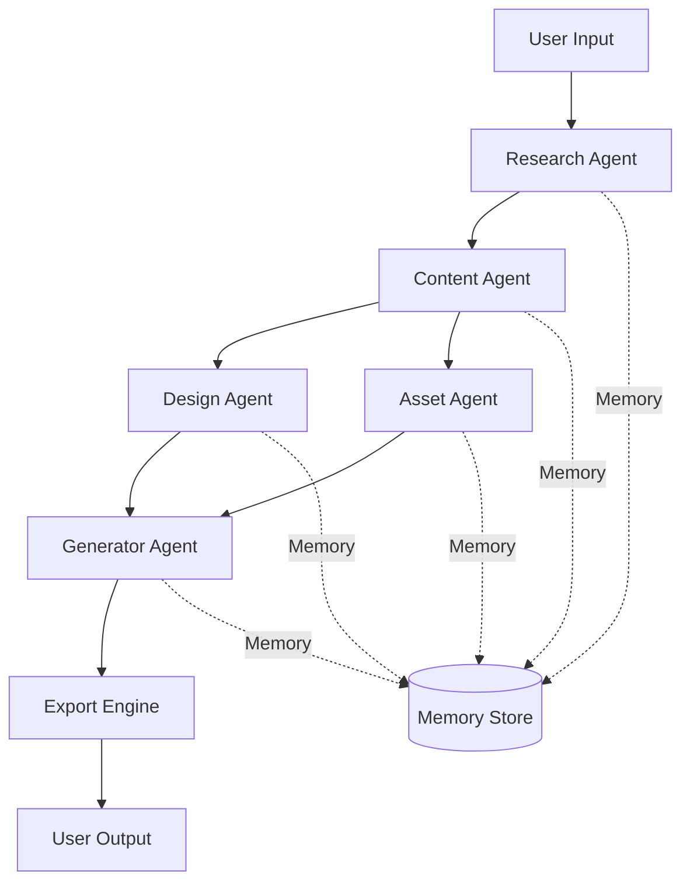

# Agent Coordination Protocol

## Overview

This document describes how the five specialized agents coordinate through Claude Flow to generate professional slides.

## Agent Definitions

### 1. Research Agent
**ID:** `research-agent`
**Role:** Topic research and information gathering
**Dependencies:** None (entry point)
**Outputs to Memory:** `swarm/research/facts`, `swarm/research/sources`

### 2. Content Agent
**ID:** `content-agent`
**Role:** Outline and content generation
**Dependencies:** Research Agent
**Outputs to Memory:** `swarm/content/outline`, `swarm/content/slides`

### 3. Design Agent
**ID:** `design-agent`
**Role:** Layout decisions and theme selection
**Dependencies:** Content Agent
**Outputs to Memory:** `swarm/design/layouts`, `swarm/design/theme`

### 4. Asset Agent
**ID:** `asset-agent`
**Role:** Image and icon discovery
**Dependencies:** Content Agent (can run parallel with Design Agent)
**Outputs to Memory:** `swarm/assets/catalog`, `swarm/assets/metadata`

### 5. Generator Agent
**ID:** `generator-agent`
**Role:** HTML generation and export
**Dependencies:** Design Agent + Asset Agent
**Outputs to Memory:** `swarm/output/html`, `swarm/output/css`

## Coordination Flow



## Hook Integration

### Pre-Task Hooks

Each agent runs pre-task hook before starting work:

```bash
npx claude-flow@alpha hooks pre-task \
  --description "[Agent] [Task description]" \
  --agent-id "[agent-id]" \
  --session-id "swarm-slide-designer"
```

**Example:**
```bash
npx claude-flow@alpha hooks pre-task \
  --description "Research Agent: Gathering information about 'AI in Healthcare'" \
  --agent-id "research-agent" \
  --session-id "swarm-slide-designer"
```

### Session Restore

Agents restore context from previous agents:

```bash
npx claude-flow@alpha hooks session-restore \
  --session-id "swarm-slide-designer"
```

This retrieves all memory keys set by previous agents in the workflow.

### Post-Edit Hooks

After generating outputs, agents store results in memory:

```bash
npx claude-flow@alpha hooks post-edit \
  --file "[output-file]" \
  --memory-key "swarm/[agent]/[output-type]"
```

**Example:**
```bash
# Research Agent stores findings
npx claude-flow@alpha hooks post-edit \
  --file "research-output.json" \
  --memory-key "swarm/research/facts"

# Content Agent stores outline
npx claude-flow@alpha hooks post-edit \
  --file "content.md" \
  --memory-key "swarm/content/outline"

# Design Agent stores decisions
npx claude-flow@alpha hooks post-edit \
  --file "design-decisions.json" \
  --memory-key "swarm/design/layouts"
```

### Notification Hooks

Agents notify the swarm of progress:

```bash
npx claude-flow@alpha hooks notify \
  --message "[Agent] completed [task]" \
  --agent-id "[agent-id]"
```

**Example:**
```bash
npx claude-flow@alpha hooks notify \
  --message "Research Agent: Found 15 sources, extracted 42 facts" \
  --agent-id "research-agent"
```

### Post-Task Hooks

After completing work, agents run post-task hook:

```bash
npx claude-flow@alpha hooks post-task \
  --task-id "[task-id]" \
  --agent-id "[agent-id]" \
  --session-id "swarm-slide-designer"
```

## Memory Schema

### Research Agent Memory

**Key:** `swarm/research/facts`
```json
{
  "topic": "AI in Healthcare",
  "domain": "Healthcare Technology",
  "facts": [
    {
      "content": "AI reduces diagnostic errors by 35%",
      "source": "https://example.com/study",
      "confidence": 0.92
    }
  ],
  "sources": [...],
  "timestamp": 1699999999
}
```

**Key:** `swarm/research/sources`
```json
{
  "sources": [
    {
      "url": "https://example.com",
      "title": "AI in Healthcare Study",
      "credibility": 0.95,
      "excerpt": "..."
    }
  ]
}
```

### Content Agent Memory

**Key:** `swarm/content/outline`
```json
{
  "title": "AI in Healthcare: Transforming Patient Care",
  "sections": [
    {
      "title": "Introduction",
      "subsections": ["Current state", "Key challenges"],
      "slideCount": 2
    }
  ]
}
```

**Key:** `swarm/content/slides`
```json
{
  "slides": [
    {
      "id": "slide-1",
      "type": "title",
      "title": "AI in Healthcare",
      "content": ["Transforming Patient Care"],
      "speakerNotes": "..."
    }
  ]
}
```

### Design Agent Memory

**Key:** `swarm/design/layouts`
```json
{
  "slides": [
    {
      "slideId": "slide-1",
      "layout": "title-centered",
      "spacing": {...},
      "colorScheme": ["#2563eb", "#ffffff"]
    }
  ]
}
```

**Key:** `swarm/design/theme`
```json
{
  "name": "professional",
  "colorPalette": {
    "primary": "#2563eb",
    "secondary": "#64748b",
    ...
  }
}
```

### Asset Agent Memory

**Key:** `swarm/assets/catalog`
```json
{
  "assets": [
    {
      "id": "asset-1",
      "slideId": "slide-1",
      "type": "image",
      "url": "https://images.unsplash.com/...",
      "relevanceScore": 0.89
    }
  ]
}
```

### Generator Agent Memory

**Key:** `swarm/output/html`
```json
{
  "html": "<!DOCTYPE html>...",
  "css": "/* Generated CSS */...",
  "metadata": {
    "slideCount": 10,
    "totalSize": 524288
  }
}
```

## Error Handling

### Agent Failure Recovery

If an agent fails, the coordinator should:

1. **Check memory for partial results**
2. **Retry with exponential backoff (3 attempts)**
3. **Fallback to alternative strategy**
4. **Notify user if unrecoverable**

**Example Recovery Flow:**

```typescript
async function executeWithRecovery(agent: Agent, maxRetries = 3) {
  for (let attempt = 1; attempt <= maxRetries; attempt++) {
    try {
      const result = await agent.execute();
      return result;
    } catch (error) {
      if (attempt === maxRetries) {
        // Try fallback strategy
        return await agent.fallback();
      }
      // Exponential backoff
      await sleep(Math.pow(2, attempt) * 1000);
    }
  }
}
```

### Fallback Strategies

| Agent | Failure Scenario | Fallback Strategy |
|-------|-----------------|-------------------|
| Research | API failure | Use LLM knowledge only |
| Content | Generation fails | Use template-based approach |
| Design | Layout decision error | Use default "text-heavy" layout |
| Asset | Image search fails | Use placeholders or icon-only |
| Generator | HTML generation fails | Export content.md only |

## Parallel Execution

Design Agent and Asset Agent can run in parallel after Content Agent completes:

```typescript
async function executeParallelPhase(contentOutput) {
  const [designResult, assetResult] = await Promise.all([
    designAgent.execute(contentOutput),
    assetAgent.execute(contentOutput)
  ]);

  return { designResult, assetResult };
}
```

## Progress Tracking

The coordinator tracks overall progress:

```typescript
interface Progress {
  stage: 'research' | 'content' | 'design' | 'assets' | 'generation';
  percentage: number;
  estimatedTimeRemaining: number;
  currentAgent: string;
}

const STAGE_WEIGHTS = {
  research: 0.20,    // 20% of total time
  content: 0.15,     // 15% of total time
  design: 0.10,      // 10% of total time
  assets: 0.35,      // 35% of total time (parallel with design)
  generation: 0.20   // 20% of total time
};
```

## Complete Workflow Example

```bash
# 1. Initialize swarm
npx claude-flow@alpha swarm init --topology mesh --max-agents 5

# 2. Research Agent
npx claude-flow@alpha hooks pre-task --description "Research: AI in Healthcare"
npx claude-flow@alpha hooks session-restore --session-id "swarm-slide-designer"
# ... research work ...
npx claude-flow@alpha hooks post-edit --file "research.json" --memory-key "swarm/research/facts"
npx claude-flow@alpha hooks notify --message "Research complete: 15 sources found"
npx claude-flow@alpha hooks post-task --task-id "research"

# 3. Content Agent
npx claude-flow@alpha hooks pre-task --description "Content: Generate outline and slides"
npx claude-flow@alpha hooks session-restore --session-id "swarm-slide-designer"
# ... content generation ...
npx claude-flow@alpha hooks post-edit --file "content.md" --memory-key "swarm/content/slides"
npx claude-flow@alpha hooks notify --message "Content complete: 10 slides generated"
npx claude-flow@alpha hooks post-task --task-id "content"

# 4. Design + Asset (Parallel)
# Design Agent
npx claude-flow@alpha hooks pre-task --description "Design: Layout decisions" &
npx claude-flow@alpha hooks session-restore --session-id "swarm-slide-designer" &
# ... design work ...
npx claude-flow@alpha hooks post-edit --file "design.json" --memory-key "swarm/design/layouts" &
npx claude-flow@alpha hooks post-task --task-id "design" &

# Asset Agent
npx claude-flow@alpha hooks pre-task --description "Asset: Discover images/icons" &
npx claude-flow@alpha hooks session-restore --session-id "swarm-slide-designer" &
# ... asset discovery ...
npx claude-flow@alpha hooks post-edit --file "assets.json" --memory-key "swarm/assets/catalog" &
npx claude-flow@alpha hooks post-task --task-id "assets" &

wait

# 5. Generator Agent
npx claude-flow@alpha hooks pre-task --description "Generator: Build HTML"
npx claude-flow@alpha hooks session-restore --session-id "swarm-slide-designer"
# ... HTML generation ...
npx claude-flow@alpha hooks post-edit --file "slides.html" --memory-key "swarm/output/html"
npx claude-flow@alpha hooks notify --message "Generation complete: HTML ready"
npx claude-flow@alpha hooks post-task --task-id "generation"

# 6. Session end
npx claude-flow@alpha hooks session-end --export-metrics true
```

## Best Practices

1. **Always restore session context** before starting agent work
2. **Store all outputs to memory** for downstream agents
3. **Use descriptive memory keys** following the `swarm/[agent]/[type]` pattern
4. **Notify on major milestones** to keep user informed
5. **Run parallel agents** when there are no dependencies
6. **Implement fallback strategies** for every agent
7. **Track progress** and provide time estimates
8. **Clean up memory** after session completion

---

**Document Version:** 1.0.0
**Last Updated:** 2025-11-08
**Status:** Complete
