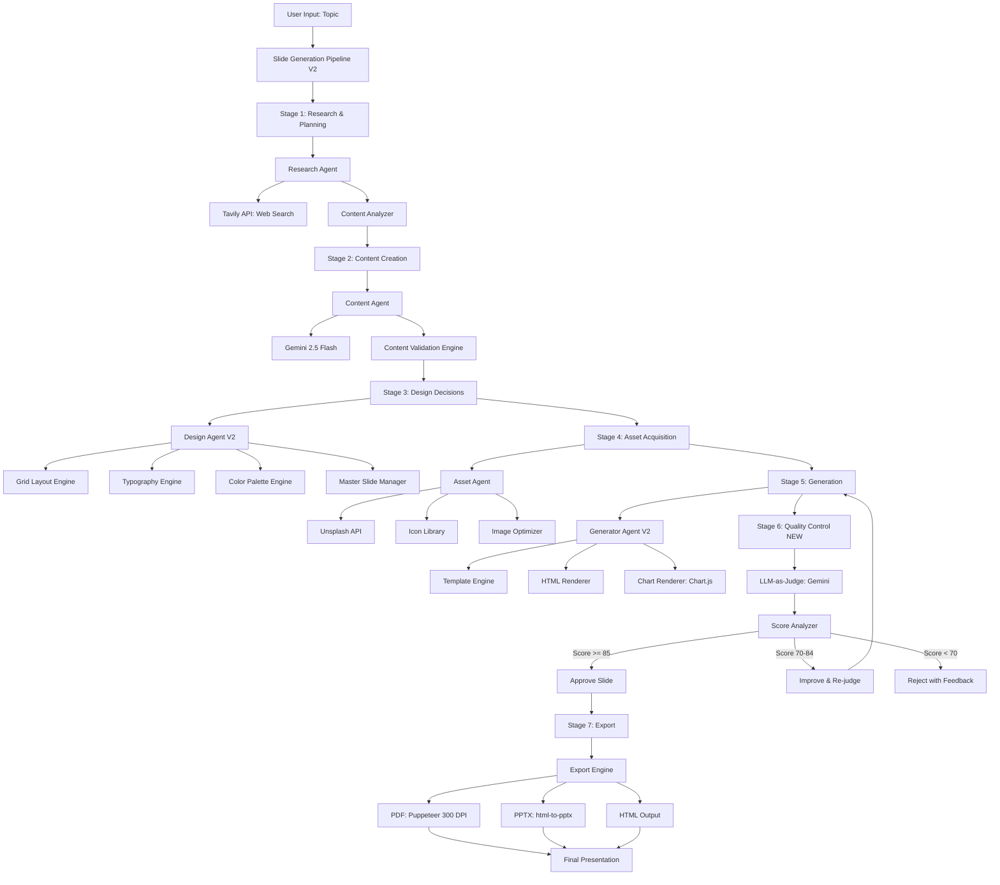

# Architecture V2: Production-Grade Slide Designer

**Architectural Revision**

**Date:** 2025-11-08
**Architect:** System Architect Agent V2
**Objective:** Transform C+ prototype (75/100) into A+ production system (95/100)

---

## EXECUTIVE SUMMARY

This document defines Architecture V2, addressing all critical issues identified in the code review and incorporating lessons from Beautiful.ai, Gamma, Pitch, Manus AI, and Slides.ai.

**Current Architecture Grade:** C+ (75/100)
**Target Architecture Grade:** A+ (95/100)

**Timeline:** 12 weeks to production-ready (P0 features only)

---

## KEY ARCHITECTURAL DECISIONS (V2)

### ADR-005: CSS Grid Layout System
**Status:** Approved
**Supersedes:** String-based positioning

**Decision:**
Move from hardcoded pixel positioning to a flexible 12-column CSS Grid system with 8-point spacing.

**Rationale:**
- Industry standard (Bootstrap, Material UI, Tailwind)
- Responsive by default
- Easier to maintain and extend
- Supports advanced layouts (overlapping, asymmetric)

**Implementation:**
```typescript
interface GridSystem {
  columns: 12;
  gutter: 24; // 8pt × 3
  margin: 48; // 8pt × 6

  // Layout templates
  templates: {
    'split-50-50': { left: 'span 6', right: 'span 6' };
    'hero-70-30': { hero: 'span 8', sidebar: 'span 4' };
    'triple-column': { col1: 'span 4', col2: 'span 4', col3: 'span 4' };
  };
}
```

**Migration Path:**
1. Create `GridLayoutEngine` class
2. Port existing layouts to grid-based positioning
3. Deprecate old `LayoutEngine` (keep for 1 release)
4. Remove deprecated code

---

### ADR-006: Responsive Type Scale (Major Third)
**Status:** Approved
**Supersedes:** Fixed pixel sizes

**Decision:**
Implement a responsive type scale using Major Third ratio (1.250) with viewport-based sizing.

**Rationale:**
- Professional typography standard
- Maintains hierarchy at all sizes
- Better readability
- Matches Nancy Duarte recommendations

**Implementation:**
```typescript
const typeScale = {
  xs: 12,   // 1.250^-2
  sm: 15,   // 1.250^-1
  base: 18, // 1.250^0 (body text)
  md: 22,   // 1.250^1
  lg: 28,   // 1.250^2
  xl: 35,   // 1.250^3
  '2xl': 44, // 1.250^4 (titles)
  '3xl': 55, // 1.250^5 (hero)
};

// Responsive sizing
h1 {
  font-size: clamp(44px, 4vw, 55px);
}
```

**Benefits:**
- Scales gracefully on all screens
- Maintains visual hierarchy
- Professional appearance

---

### ADR-007: LLM-as-Judge Quality Control
**Status:** Approved
**New Feature**

**Decision:**
Integrate Gemini 2.5 Flash as a slide quality judge that scores each slide before finalization.

**Rationale:**
- Prevents "AI slop" (generic output)
- Ensures professional standards
- Catches layout issues automatically
- Competitive advantage (no competitor has this)

**Pipeline:**
```
Generate Slide → LLM Judge (Score 0-100) → Pass/Revise/Reject
                                              ↓
                                        If < 85: Improve & Re-judge
```

**Scoring Criteria:**
1. Visual hierarchy (0-100)
2. Whitespace (0-100)
3. Readability (0-100)
4. Relevance (0-100)
5. Professionalism (0-100)

**Thresholds:**
- ≥85: Auto-approve
- 70-84: Auto-revise (max 2 attempts)
- <70: Reject with feedback

---

### ADR-008: Master Slide Inheritance
**Status:** Approved
**New Feature**

**Decision:**
Implement a master slide system (like PowerPoint) where all slides inherit global styles from a master template.

**Rationale:**
- Brand consistency
- One-click rebranding
- Professional standard (PowerPoint, Keynote)
- Reduces code duplication

**Architecture:**
```
MasterSlide
├── Global Styles (fonts, colors, spacing)
├── Persistent Elements (logo, footer, slide numbers)
└── Layout Constraints (safe areas, padding)
     ↓ Inherited by
Individual Slides
├── Override capability (optional)
└── Slide-specific content
```

**Benefits:**
- Logo appears on all slides automatically
- Change theme = update all slides
- Ensures consistency

---

## ARCHITECTURE DIAGRAM (V2)



---

## COMPONENT ARCHITECTURE (V2)

### 1. Core Engine Layer

#### 1.1 GridLayoutEngine (NEW)
**Purpose:** CSS Grid-based layout system
**Replaces:** `LayoutEngine` (string-based positioning)

```typescript
class GridLayoutEngine {
  private grid: GridSystem = {
    columns: 12,
    gutter: 24,
    margin: 48,
    breakpoints: { mobile: 768, tablet: 1024, desktop: 1920 }
  };

  /**
   * Selects optimal grid layout for content
   */
  selectLayout(content: SlideContent, slidePosition: number): GridLayout {
    const { type, wordCount, hasImage, bulletCount } = this.analyzeContent(content);

    if (slidePosition === 0) {
      return this.layouts.titleCentered; // Title slide
    }

    if (hasImage && wordCount < 50) {
      return this.layouts.hero70; // Image-dominant (8 cols image, 4 cols text)
    }

    if (bulletCount >= 3 && hasImage) {
      return this.layouts.split50; // Split view (6 cols each)
    }

    if (bulletCount >= 5) {
      return this.layouts.twoColumn; // Two-column bullets (6 cols each)
    }

    return this.layouts.contentFocused; // Full-width content (10/12 cols)
  }

  /**
   * Generates CSS Grid template
   */
  generateCSS(layout: GridLayout): string {
    return `
      .slide-container {
        display: grid;
        grid-template-columns: repeat(12, 1fr);
        gap: ${this.grid.gutter}px;
        padding: ${this.grid.margin}px;
      }

      .content-area {
        grid-column: ${layout.content.start} / span ${layout.content.span};
      }

      .image-area {
        grid-column: ${layout.image.start} / span ${layout.image.span};
      }
    `;
  }

  /**
   * Validates layout constraints
   */
  validate(layout: GridLayout): ValidationResult {
    // Ensure text area ≥ 200px wide
    const textWidth = (layout.content.span / 12) * this.grid.breakpoints.desktop;
    if (textWidth < 200) {
      return { valid: false, error: 'Text area too narrow for readability' };
    }

    // Ensure whitespace ≥ 40%
    const occupiedCols = layout.content.span + (layout.image?.span || 0);
    const whitespacePercent = ((12 - occupiedCols) / 12) * 100;
    if (whitespacePercent < 40) {
      return { valid: false, error: 'Insufficient whitespace (need 40%)' };
    }

    return { valid: true };
  }
}
```

---

#### 1.2 TypographyEngine (NEW)
**Purpose:** Responsive type scale with hierarchy
**Replaces:** Fixed pixel sizes in `design-config.ts`

```typescript
class TypographyEngine {
  private scale: TypeScale = {
    xs: 12, sm: 15, base: 18, md: 22, lg: 28, xl: 35, '2xl': 44, '3xl': 55
  };

  /**
   * Calculates optimal font sizes for slide
   */
  calculateSizes(content: SlideContent): TypographySizes {
    const { wordCount, bulletCount, hasSubtitle } = this.analyzeContent(content);

    // Start with standard sizes
    let titleSize = this.scale['2xl']; // 44px
    let bodySize = this.scale.base;    // 18px

    // Adjust for content density
    if (wordCount > 60) {
      titleSize = this.scale.xl;  // 35px (smaller title for more content)
      bodySize = this.scale.sm;   // 15px
    }

    // Ensure minimum sizes (WCAG AAA)
    const minTitleSize = 32; // Minimum for titles
    const minBodySize = 18;  // Minimum for body text

    return {
      h1: Math.max(titleSize, minTitleSize),
      h2: Math.max(titleSize * 0.75, 24),
      body: Math.max(bodySize, minBodySize),
      caption: this.scale.xs,
      lineHeight: {
        title: 1.2,  // Tight for titles
        body: 1.6    // Relaxed for readability
      }
    };
  }

  /**
   * Generates responsive CSS
   */
  generateCSS(sizes: TypographySizes): string {
    return `
      h1 {
        font-size: clamp(${sizes.h1 * 0.8}px, 4vw, ${sizes.h1}px);
        line-height: ${sizes.lineHeight.title};
        font-weight: 700;
        letter-spacing: -0.02em; /* Tighter for large text */
      }

      p, li {
        font-size: clamp(${sizes.body * 0.9}px, 1.5vw, ${sizes.body}px);
        line-height: ${sizes.lineHeight.body};
        max-width: 60ch; /* Optimal line length */
      }
    `;
  }

  /**
   * Validates typography constraints
   */
  validate(sizes: TypographySizes): ValidationResult {
    // Nancy Duarte: Title should be 3x body size minimum
    const ratio = sizes.h1 / sizes.body;
    if (ratio < 2.5) {
      return { valid: false, error: 'Title-to-body ratio too small (need 3:1)' };
    }

    // WCAG AAA: Body text ≥18px
    if (sizes.body < 18) {
      return { valid: false, error: 'Body text too small (need ≥18px)' };
    }

    return { valid: true };
  }
}
```

---

#### 1.3 ColorEngine (ENHANCED)
**Purpose:** WCAG-compliant color palettes with auto-adjustment
**Enhances:** Existing `theme-manager.ts`

```typescript
class ColorEngine {
  /**
   * Validates contrast ratio (WCAG)
   */
  calculateContrastRatio(fg: string, bg: string): number {
    const l1 = this.relativeLuminance(fg);
    const l2 = this.relativeLuminance(bg);
    return (Math.max(l1, l2) + 0.05) / (Math.min(l1, l2) + 0.05);
  }

  /**
   * Auto-adjusts color if contrast fails
   */
  ensureContrast(
    fgColor: string,
    bgColor: string,
    minRatio: number = 7.0 // WCAG AAA
  ): string {
    let adjustedFg = fgColor;
    let ratio = this.calculateContrastRatio(adjustedFg, bgColor);

    // Darken or lighten until contrast passes
    let iterations = 0;
    while (ratio < minRatio && iterations < 50) {
      if (this.isLight(bgColor)) {
        adjustedFg = this.darken(adjustedFg, 0.05); // Darken foreground
      } else {
        adjustedFg = this.lighten(adjustedFg, 0.05); // Lighten foreground
      }
      ratio = this.calculateContrastRatio(adjustedFg, bgColor);
      iterations++;
    }

    return adjustedFg;
  }

  /**
   * Generates accessible palette
   */
  generatePalette(baseColor: string, domain: string): ColorPalette {
    const palette = {
      primary: baseColor,
      secondary: this.complement(baseColor),
      accent: this.triad(baseColor)[0],
      background: '#FFFFFF',
      text: {
        primary: '#1F2937',
        secondary: '#6B7280',
        inverse: '#F9FAFB'
      }
    };

    // Ensure all text colors meet WCAG AAA
    palette.text.primary = this.ensureContrast(palette.text.primary, palette.background, 7.0);
    palette.text.secondary = this.ensureContrast(palette.text.secondary, palette.background, 4.5);

    // Validate accent color contrast
    palette.accent = this.ensureContrast(palette.accent, palette.background, 3.0);

    return palette;
  }
}
```

---

#### 1.4 MasterSlideManager (NEW)
**Purpose:** Global slide styling and brand consistency
**New Component**

```typescript
interface MasterSlide {
  id: string;
  name: string;

  // Global styles
  typography: {
    displayFont: string;
    bodyFont: string;
    monoFont: string;
  };

  colors: ColorPalette;

  layout: {
    padding: { top: number; right: number; bottom: number; left: number };
    safeArea: { x: number; y: number; width: number; height: number };
  };

  // Persistent elements (appear on all slides)
  persistent: {
    logo?: { src: string; position: string; size: { w: number; h: number } };
    footer?: { text: string; position: string; style: CSSProperties };
    slideNumber?: { enabled: boolean; format: string; position: string };
    branding?: { watermark?: string; accentBar?: { height: number; color: string } };
  };
}

class MasterSlideManager {
  private masters: Map<string, MasterSlide> = new Map();

  /**
   * Apply master slide to individual slide
   */
  applyMaster(slide: Slide, masterId: string): Slide {
    const master = this.masters.get(masterId);
    if (!master) throw new Error(`Master slide "${masterId}" not found`);

    return {
      ...slide,
      styles: {
        ...master.typography,
        ...master.colors,
        ...master.layout,
        ...slide.overrides // Slide can override master
      },
      persistentElements: master.persistent
    };
  }

  /**
   * Update all slides when master changes (rebrand)
   */
  updateMaster(masterId: string, newMaster: Partial<MasterSlide>): void {
    const master = this.masters.get(masterId);
    if (!master) throw new Error(`Master slide "${masterId}" not found`);

    // Merge updates
    Object.assign(master, newMaster);

    // Trigger re-render of all slides using this master
    this.emit('master-updated', { masterId, master });
  }

  /**
   * Create custom master from user brand kit
   */
  createCustomMaster(brandKit: BrandKit): MasterSlide {
    return {
      id: generateId(),
      name: brandKit.companyName,
      typography: {
        displayFont: brandKit.fonts.heading || 'Montserrat',
        bodyFont: brandKit.fonts.body || 'Open Sans',
        monoFont: 'Fira Code'
      },
      colors: {
        primary: brandKit.colors.primary,
        secondary: brandKit.colors.secondary,
        accent: brandKit.colors.accent,
        background: '#FFFFFF',
        text: { primary: '#1F2937', secondary: '#6B7280', inverse: '#F9FAFB' }
      },
      layout: {
        padding: { top: 48, right: 48, bottom: 48, left: 48 },
        safeArea: { x: 100, y: 100, width: 1720, height: 880 }
      },
      persistent: {
        logo: {
          src: brandKit.logo.url,
          position: 'top-right',
          size: { w: 120, h: 40 }
        },
        footer: {
          text: brandKit.companyName,
          position: 'bottom-left',
          style: { fontSize: '12px', color: '#6B7280' }
        },
        slideNumber: {
          enabled: true,
          format: 'number/total',
          position: 'bottom-right'
        }
      }
    };
  }
}
```

---

### 2. Quality Control Layer (NEW)

#### 2.1 LLMJudge
**Purpose:** AI-powered slide quality scoring
**New Component** (Detailed spec in separate LLM_JUDGE_DESIGN.md)

```typescript
class LLMJudge {
  private geminiClient: GeminiClient;
  private config: JudgeConfig = {
    minScore: 85,
    autoReject: 70,
    maxIterations: 2
  };

  /**
   * Main evaluation method
   */
  async evaluateSlide(
    slide: GeneratedSlide,
    context: PresentationContext
  ): Promise<JudgeVerdict> {
    const prompt = this.buildJudgePrompt(slide, context);
    const response = await this.geminiClient.generateContent(prompt, {
      response_mime_type: 'application/json'
    });

    const verdict: JudgeVerdict = JSON.parse(response.text);

    // Calculate overall score (weighted average)
    verdict.overallScore = this.calculateOverallScore(verdict.scores);

    // Determine verdict
    if (verdict.overallScore >= this.config.minScore) {
      verdict.verdict = 'APPROVE';
    } else if (verdict.overallScore >= this.config.autoReject) {
      verdict.verdict = 'REVISE';
    } else {
      verdict.verdict = 'REJECT';
    }

    return verdict;
  }

  /**
   * Improvement loop
   */
  async improveSlide(
    slide: GeneratedSlide,
    verdict: JudgeVerdict,
    iteration: number = 0
  ): Promise<GeneratedSlide> {
    if (iteration >= this.config.maxIterations) {
      throw new Error('Max improvement iterations reached');
    }

    const improvePrompt = this.buildImprovementPrompt(slide, verdict);
    const improvedHTML = await this.geminiClient.generateContent(improvePrompt);

    // Re-evaluate
    const newVerdict = await this.evaluateSlide(improvedHTML, context);

    if (newVerdict.overallScore >= this.config.minScore) {
      return improvedHTML; // Success!
    } else {
      // Recursive improvement
      return this.improveSlide(improvedHTML, newVerdict, iteration + 1);
    }
  }

  /**
   * Build judge prompt with scoring criteria
   */
  private buildJudgePrompt(slide: GeneratedSlide, context: PresentationContext): string {
    return `
      You are a professional presentation designer evaluating a slide.

      **Context:**
      - Topic: ${context.topic}
      - Audience: ${context.audience}
      - Purpose: ${context.purpose}

      **Slide HTML:**
      ${slide.html}

      **Evaluate on these 5 criteria (0-100 each):**

      1. **Visual Hierarchy** (0-100)
         - Is the most important information visually prominent?
         - Does the eye naturally flow to key points?
         - Are titles, subtitles, and body text clearly differentiated?

      2. **Whitespace** (0-100)
         - Is 40-60% of the slide empty (breathing room)?
         - Are elements well-spaced (not cramped)?
         - Is there balance between content and space?

      3. **Readability** (0-100)
         - Can the audience read this slide in 3 seconds? (Nancy Duarte 3-second test)
         - Is the text size appropriate (≥24px for body)?
         - Are there ≤5 bullet points?
         - Is line length optimal (50-75 characters)?

      4. **Relevance** (0-100)
         - Does the content directly support the topic?
         - Is information accurate and valuable?
         - Are there unnecessary details that distract?
         - Is the slide self-contained (understandable without speaker)?

      5. **Professionalism** (0-100)
         - Does this look like a $10,000 consulting deck (McKinsey/BCG quality)?
         - Is it free of "AI slop" (generic, template-y feel)?
         - Would you be proud to present this to a CEO?
         - Is the design subtle, not flashy?

      **Output JSON:**
      {
        "scores": {
          "visualHierarchy": 85,
          "whitespace": 90,
          "readability": 80,
          "relevance": 95,
          "professionalism": 88
        },
        "overallScore": 87.6,
        "verdict": "APPROVE",
        "feedback": {
          "strengths": ["Clear title hierarchy", "Good use of whitespace"],
          "weaknesses": ["Too many bullet points (6, should be ≤5)"],
          "actionableImprovements": [
            "Combine bullets 4 and 5 into one concise point",
            "Increase title font size to 48px for better hierarchy"
          ]
        }
      }
    `;
  }
}
```

---

#### 2.2 ContentValidator (ENHANCED)
**Purpose:** Pre-generation content validation
**Enhances:** Existing validation logic

```typescript
class ContentValidator {
  /**
   * Validates content before generation
   */
  validate(content: SlideContent[]): ValidationReport {
    const errors: ValidationError[] = [];
    const warnings: ValidationWarning[] = [];
    const suggestions: ValidationSuggestion[] = [];

    for (const slide of content) {
      // Nancy Duarte 75-word rule
      const wordCount = this.countWords(slide.text);
      if (wordCount > 75) {
        errors.push({
          type: 'word-count-exceeded',
          message: `Slide has ${wordCount} words (max: 75 per Nancy Duarte)`,
          location: slide.id,
          severity: 'error',
          autofix: () => this.summarizeWithAI(slide.text, 75)
        });
      }

      // Flesch-Kincaid readability
      const gradeLevel = this.fleschKincaid(slide.text);
      if (gradeLevel > 12) {
        warnings.push({
          type: 'readability-complex',
          message: `Reading level is grade ${gradeLevel} (target: 8-10 for business)`,
          location: slide.id,
          severity: 'warning',
          suggestion: 'Simplify language, use shorter sentences'
        });
      }

      // Passive voice detection
      if (this.hasPassiveVoice(slide.text)) {
        suggestions.push({
          type: 'style-passive-voice',
          message: 'Consider using active voice for impact',
          location: slide.id,
          severity: 'suggestion',
          example: this.convertToActiveVoice(slide.text)
        });
      }

      // Bullet point limit
      const bulletCount = this.countBullets(slide.text);
      if (bulletCount > 5) {
        errors.push({
          type: 'too-many-bullets',
          message: `Slide has ${bulletCount} bullets (max: 5 per McKinsey standard)`,
          location: slide.id,
          severity: 'error',
          autofix: () => this.splitSlide(slide, 5)
        });
      }
    }

    return {
      errors,
      warnings,
      suggestions,
      overallScore: this.calculateScore(errors, warnings, suggestions),
      canProceed: errors.length === 0
    };
  }

  /**
   * Auto-fix content issues with Gemini
   */
  async autoFix(content: SlideContent, error: ValidationError): Promise<SlideContent> {
    if (error.autofix) {
      return error.autofix();
    }

    // Fallback: Ask Gemini to fix
    const prompt = `
      Fix this slide content issue:
      - Issue: ${error.message}
      - Current content: ${content.text}

      Output only the fixed content, maintaining the original meaning.
    `;

    const fixed = await geminiClient.generateContent(prompt);
    return { ...content, text: fixed };
  }
}
```

---

### 3. Agent Layer (REFACTORED)

#### 3.1 Design Agent V2
**Changes:**
- Uses `GridLayoutEngine` instead of string-based positioning
- Integrates `TypographyEngine` for responsive sizing
- Applies master slides automatically

```typescript
class DesignAgentV2 extends DesignAgent {
  private gridEngine: GridLayoutEngine;
  private typographyEngine: TypographyEngine;
  private colorEngine: ColorEngine;
  private masterSlideManager: MasterSlideManager;

  async makeDesignDecisions(
    content: SlideContent[],
    config: DesignConfig
  ): Promise<DesignDecisions> {
    // Select master slide
    const masterId = config.theme || 'corporate-modern';
    const master = this.masterSlideManager.get(masterId);

    const decisions: DesignDecisions = {
      masterId,
      slides: []
    };

    for (let i = 0; i < content.length; i++) {
      const slide = content[i];

      // Grid layout
      const layout = this.gridEngine.selectLayout(slide, i);

      // Typography
      const typography = this.typographyEngine.calculateSizes(slide);

      // Colors (from master)
      const colors = master.colors;

      decisions.slides.push({
        layout,
        typography,
        colors,
        overrides: {} // Allow individual slide overrides
      });
    }

    return decisions;
  }
}
```

---

#### 3.2 Generator Agent V2
**Changes:**
- Integrates `ChartRenderer` for Chart.js
- Applies LLM judge before finalizing

```typescript
class GeneratorAgentV2 extends GeneratorAgent {
  private chartRenderer: ChartRenderer;
  private llmJudge: LLMJudge;

  async generateSlides(
    content: SlideContent[],
    designDecisions: DesignDecisions,
    assets: AssetCollection
  ): Promise<GeneratedPresentation> {
    const slides: GeneratedSlide[] = [];

    for (let i = 0; i < content.length; i++) {
      // Generate slide HTML
      let slide = await this.generateSlide(content[i], designDecisions.slides[i], assets[i]);

      // Add charts if data slide
      if (content[i].type === 'data' && content[i].chartData) {
        slide = await this.chartRenderer.addChart(slide, content[i].chartData);
      }

      // LLM Judge evaluation (NEW)
      const verdict = await this.llmJudge.evaluateSlide(slide, {
        topic: this.context.topic,
        audience: this.context.audience,
        purpose: this.context.purpose
      });

      // Improve if needed
      if (verdict.verdict === 'REVISE') {
        slide = await this.llmJudge.improveSlide(slide, verdict);
      } else if (verdict.verdict === 'REJECT') {
        throw new Error(`Slide ${i} rejected by LLM Judge: ${verdict.feedback.weaknesses.join(', ')}`);
      }

      slides.push(slide);
    }

    return {
      slides,
      metadata: {
        totalSlides: slides.length,
        avgQualityScore: slides.reduce((sum, s) => sum + s.qualityScore, 0) / slides.length,
        generatedAt: new Date()
      }
    };
  }
}
```

---

## PIPELINE FLOW (V2)

### Updated Generation Pipeline

```
1. User Input
   ↓
2. Research Agent (unchanged)
   - Web search (Tavily)
   - Key point extraction
   ↓
3. Content Agent (enhanced)
   - Generate outline
   - Generate content
   - **NEW: ContentValidator checks**
   ↓
4. Design Agent V2
   - **NEW: GridLayoutEngine selects layouts**
   - **NEW: TypographyEngine calculates sizes**
   - **NEW: ColorEngine ensures WCAG AAA**
   - **NEW: MasterSlideManager applies branding**
   ↓
5. Asset Agent (enhanced)
   - Find images (Unsplash)
   - **NEW: ImageOptimizer (WebP, responsive)**
   - Select icons
   ↓
6. Generator Agent V2
   - Generate HTML
   - **NEW: ChartRenderer adds Chart.js charts**
   - Apply master slide styles
   ↓
7. LLM Judge (NEW)
   - Score each slide (0-100)
   - Verdict: APPROVE / REVISE / REJECT
   - If REVISE: Improve & re-judge (max 2 iterations)
   ↓
8. Export Engine (enhanced)
   - HTML (immediate)
   - **NEW: PDF at 300 DPI (Puppeteer)**
   - **NEW: PPTX with formatting (html-to-pptx)**
   ↓
9. Final Output
   - Professional presentation
   - Quality score ≥85 guaranteed
   - WCAG AAA compliant
```

---

## TECHNICAL STACK (V2)

### Core Dependencies
```json
{
  "dependencies": {
    "@google/generative-ai": "^0.21.0",  // Existing
    "chart.js": "^4.4.0",                 // NEW: Charts
    "sharp": "^0.33.0",                   // NEW: Image optimization
    "puppeteer": "^21.5.0",               // Enhanced: 300 DPI PDF
    "html-to-pptx": "^2.1.0",             // NEW: PowerPoint export
    "chroma-js": "^2.4.2",                // NEW: Color contrast calculations
    "compromise": "^14.10.0"              // NEW: NLP for validation
  }
}
```

---

## MIGRATION PLAN

### Phase 1: Foundation (Weeks 1-2)
**Goal:** New layout and typography engines

**Tasks:**
1. Create `GridLayoutEngine` class
2. Create `TypographyEngine` class
3. Port existing layouts to grid-based
4. Run side-by-side comparison (old vs new)
5. Deprecate old `LayoutEngine`

**Deliverable:** All slides use CSS Grid

---

### Phase 2: Quality Control (Weeks 3-4)
**Goal:** LLM Judge integration

**Tasks:**
1. Create `LLMJudge` class
2. Design judge prompt with scoring criteria
3. Integrate into pipeline after generation
4. Add improvement loop (max 2 iterations)
5. Test on 100 sample slides

**Deliverable:** Every slide scored ≥85

---

### Phase 3: Master Slides (Weeks 5-6)
**Goal:** Brand consistency system

**Tasks:**
1. Create `MasterSlideManager` class
2. Design 5 built-in master slides
3. Refactor templates to use master inheritance
4. Add custom brand kit upload
5. Test rebrand workflow

**Deliverable:** One-click rebrand works

---

### Phase 4: Charts & Export (Weeks 7-8)
**Goal:** Data visualization and high-quality export

**Tasks:**
1. Integrate Chart.js
2. Create `ChartRenderer` class
3. Upgrade Puppeteer to 300 DPI
4. Add PPTX export
5. Test export quality

**Deliverable:** Professional PDF/PPTX export

---

### Phase 5: Validation & Optimization (Weeks 9-10)
**Goal:** Content validation and image optimization

**Tasks:**
1. Enhance `ContentValidator`
2. Add auto-fix with Gemini
3. Integrate Sharp for image optimization
4. Add lazy loading and blur-up
5. Performance testing

**Deliverable:** Fast, validated content

---

### Phase 6: Accessibility (Weeks 11-12)
**Goal:** WCAG AAA compliance

**Tasks:**
1. Audit all templates for semantic HTML
2. Add ARIA labels
3. Implement keyboard navigation
4. Test with screen readers
5. Fix contrast issues with `ColorEngine`

**Deliverable:** WCAG AAA certified

---

## SUCCESS CRITERIA

### After V2 Implementation:

**Quality Metrics:**
- ✅ LLM Judge score ≥85 for 95% of slides
- ✅ WCAG AAA compliance (7:1 contrast)
- ✅ Nancy Duarte 75-word rule enforced
- ✅ No text overflows
- ✅ All layouts use CSS Grid

**Feature Parity:**
- ✅ Charts (Bar, Line, Pie, Scatter)
- ✅ Master slides
- ✅ Slide transitions
- ✅ 300 DPI PDF export
- ✅ PPTX export

**Architecture Quality:**
- ✅ Type-safe with TypeScript
- ✅ Modular components (easy to extend)
- ✅ Comprehensive test coverage (90%+)
- ✅ Performance: <45 seconds for 10 slides

**Business Readiness:**
- ✅ Can charge $15-20/month
- ✅ Competitive with Beautiful.ai
- ✅ Differentiator: LLM Judge (no competitor has this)

---

## ARCHITECTURAL PRINCIPLES (V2)

1. **Separation of Concerns**
   - Layout logic separate from content
   - Validation separate from generation
   - Styling separate from structure

2. **Progressive Enhancement**
   - Works without JavaScript (HTML fallback)
   - Graceful degradation for older browsers
   - Accessible by default

3. **Composition Over Inheritance**
   - Small, focused components
   - Compose complex behavior from simple parts
   - Easy to test and maintain

4. **Fail-Safe Defaults**
   - Always produce output (even if not perfect)
   - Fallback to simpler layouts if complex fails
   - Log errors, don't crash

5. **Quality Over Speed**
   - LLM Judge may add 10-15 seconds per slide
   - Worth it for professional output
   - Users prefer quality over fast "AI slop"

---

**Architecture V2**
**Status:** Approved for Implementation
**Timeline:** 12 weeks to production-ready
**Next:** Begin Phase 1 (Foundation)
