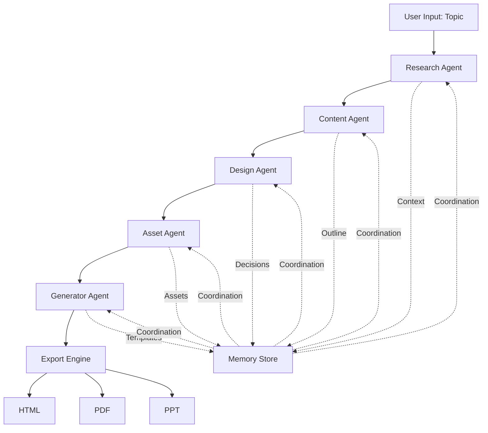
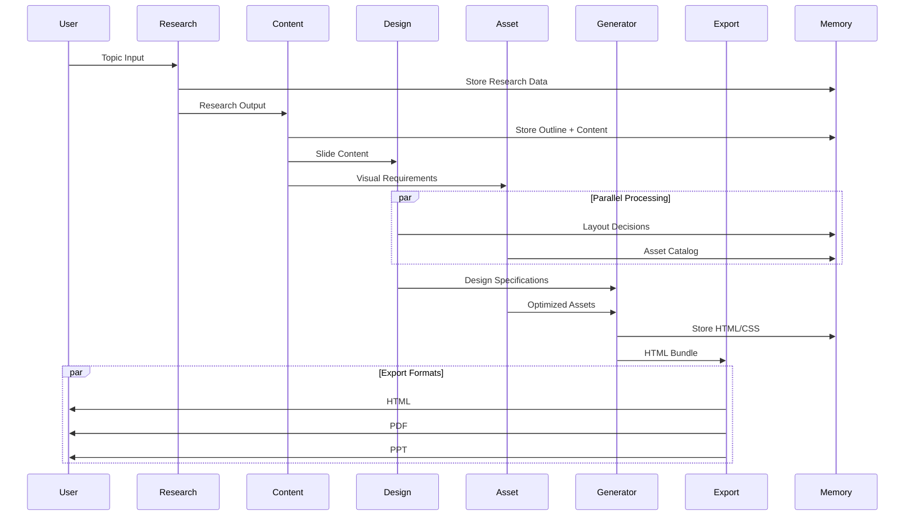

# Slide Designer AI - System Architecture

## Executive Summary

This document outlines the complete system architecture for an agentic AI slide designer that transforms topics into professional presentations through intelligent research, content generation, and design decisions.

## System Overview



## Architecture Decision Records (ADRs)

### ADR-001: Agentic Multi-Agent Architecture

**Status:** Accepted

**Context:** Need to handle complex workflow from research to export with specialized capabilities at each stage.

**Decision:** Implement five specialized agents (Research, Content, Design, Asset, Generator) coordinated through Claude Flow memory system.

**Rationale:**
- Separation of concerns enables specialization
- Parallel execution where possible (asset discovery + layout design)
- Memory-based coordination ensures consistency
- Each agent can be optimized independently

**Consequences:**
- Improved maintainability through modularity
- Better testability of individual components
- Slight overhead from agent coordination
- Requires robust error handling between agents

### ADR-002: Gemini 2.5 Flash for Content Generation

**Status:** Accepted

**Context:** Need fast, high-quality content generation with good instruction following.

**Decision:** Use Gemini 2.5 Flash as the primary LLM for content generation, outline creation, and text refinement.

**Rationale:**
- Fast inference speed (critical for user experience)
- Strong instruction following for structured outputs
- Good context window for research synthesis
- Cost-effective for repeated generations

**Alternatives Considered:**
- GPT-4: Higher quality but slower and more expensive
- Claude Sonnet: Excellent quality but API limitations
- Open-source models: Inconsistent quality, infrastructure overhead

### ADR-003: HTML-First Generation with Export Pipeline

**Status:** Accepted

**Context:** Need flexible output formats (HTML, PDF, PPT) with consistent design.

**Decision:** Generate slides as HTML first, then convert to other formats using specialized tools.

**Rationale:**
- HTML provides maximum styling flexibility
- CSS enables sophisticated layouts
- Puppeteer for PDF conversion (pixel-perfect)
- html-to-pptx for PowerPoint compatibility
- Single source of truth for design decisions

**Architecture:**
```
HTML Generation → PDF (Puppeteer) → PPT (html-to-pptx)
                ↓
            Preview Server
```

### ADR-004: Rule-Based + AI Hybrid Layout Engine

**Status:** Accepted

**Context:** Need consistent, professional layouts that handle diverse content types.

**Decision:** Combine rule-based layout engine with AI-assisted decision making.

**Rationale:**
- Rules ensure consistency and professionalism
- AI handles edge cases and creative decisions
- Fallback strategy when AI is uncertain
- Performance optimized (rules are fast)

**Decision Flow:**
1. Rule-based analysis of content structure
2. AI evaluation for ambiguous cases
3. Template selection from design library
4. AI refinement of spacing/colors

## System Components

### 1. Research Agent

**Purpose:** Gather comprehensive information about the topic from web sources.

**Capabilities:**
- Web search integration (Tavily API recommended)
- Source credibility assessment
- Information synthesis
- Fact extraction and verification
- Topic domain classification

**Input:**
```typescript
interface ResearchInput {
  topic: string;
  depth: 'quick' | 'standard' | 'deep';
  audience?: 'general' | 'technical' | 'executive';
  constraints?: {
    timeLimit?: number;
    maxSources?: number;
    preferredDomains?: string[];
  };
}
```

**Output:**
```typescript
interface ResearchOutput {
  topic: string;
  domain: string;
  keyFacts: Fact[];
  sources: Source[];
  suggestedStructure: OutlineHint[];
  confidenceScore: number;
  researchMetadata: {
    sourcesConsulted: number;
    duration: number;
    topicComplexity: 'low' | 'medium' | 'high';
  };
}
```

**Workflow:**
1. Topic analysis and domain classification
2. Query generation (3-5 search queries)
3. Parallel web searches
4. Source credibility filtering
5. Content extraction and synthesis
6. Fact structuring and categorization
7. Output generation with confidence scores

### 2. Content Agent

**Purpose:** Transform research into structured presentation content with clear narrative flow.

**Capabilities:**
- Outline generation with logical flow
- Content.md creation following outline structure
- Slide-level content planning
- Speaker notes generation
- Title and subtitle creation
- Bullet point optimization (3-5 per slide)

**Input:**
```typescript
interface ContentInput {
  research: ResearchOutput;
  slideCount?: number;
  style?: 'persuasive' | 'informative' | 'educational' | 'storytelling';
  toneOfVoice?: 'formal' | 'casual' | 'technical';
}
```

**Output:**
```typescript
interface ContentOutput {
  outline: Outline;
  contentMd: string; // Full content.md file
  slides: SlideContent[];
  metadata: {
    totalSlides: number;
    estimatedDuration: number;
    readabilityScore: number;
  };
}

interface SlideContent {
  id: string;
  type: 'title' | 'content' | 'section' | 'conclusion';
  title: string;
  content: string[];
  speakerNotes?: string;
  suggestedVisuals?: string[];
}
```

**Content Generation Rules:**
- Max 6 slides for quick presentations
- Max 12 slides for standard presentations
- Max 20 slides for deep dives
- 3-5 bullet points per content slide
- Each bullet point: 5-10 words maximum
- Title slides: 1 main title + optional subtitle
- Section dividers every 3-4 slides for long presentations

### 3. Design Agent

**Purpose:** Make intelligent layout and design decisions for each slide.

**Capabilities:**
- Layout template selection
- Visual hierarchy design
- Color scheme generation
- Typography decisions
- White space calculation
- Visual element placement
- Accessibility compliance

**Input:**
```typescript
interface DesignInput {
  slides: SlideContent[];
  brand?: BrandGuidelines;
  theme?: 'minimal' | 'corporate' | 'creative' | 'academic';
}

interface BrandGuidelines {
  colors?: {
    primary: string;
    secondary: string;
    accent: string;
  };
  fonts?: {
    heading: string;
    body: string;
  };
  logo?: string;
}
```

**Output:**
```typescript
interface DesignOutput {
  slides: SlideDesign[];
  globalTheme: Theme;
  colorPalette: ColorPalette;
  designDecisions: DesignDecisionLog[];
}

interface SlideDesign {
  slideId: string;
  layout: LayoutType;
  visualElements: VisualElement[];
  spacing: SpacingRules;
  colorScheme: string[];
  typography: TypographyRules;
}

type LayoutType =
  | 'title-centered'
  | 'title-left-content-right'
  | 'full-image-overlay'
  | 'split-content'
  | 'grid-layout'
  | 'text-heavy'
  | 'visual-dominant';
```

**Layout Decision Engine:**

The Design Agent uses a sophisticated decision tree:

```
Content Analysis
├─ Word Count < 20 → Consider image-dominant layout
├─ Word Count 20-50 → Balanced text/visual layout
├─ Word Count 50-100 → Text-heavy with supporting visuals
└─ Word Count > 100 → Split into multiple slides

Content Type
├─ Statistical → Use charts/graphs
├─ Process → Use diagrams/flowcharts
├─ Comparison → Use side-by-side layout
├─ Timeline → Use horizontal timeline
└─ Conceptual → Use icons + text boxes

Slide Position
├─ First slide → Title layout with hero image
├─ Last slide → Summary/CTA with minimal visuals
├─ Section divider → Full-background image with overlay text
└─ Content slide → Apply content-based rules
```

### 4. Asset Agent

**Purpose:** Discover and optimize visual assets (images, icons, illustrations).

**Capabilities:**
- Image search (Unsplash API, Pexels API)
- Icon discovery (Font Awesome, Iconify)
- Image quality assessment
- Relevance scoring
- Image optimization (resizing, compression)
- Alt text generation
- License compliance checking

**Input:**
```typescript
interface AssetInput {
  slides: SlideDesign[];
  assetRequirements: AssetRequirement[];
  quality?: 'standard' | 'high' | 'print';
}

interface AssetRequirement {
  slideId: string;
  assetType: 'image' | 'icon' | 'illustration' | 'chart';
  query: string;
  placement: 'background' | 'foreground' | 'inline';
  style?: string;
}
```

**Output:**
```typescript
interface AssetOutput {
  assets: Asset[];
  metadata: AssetMetadata;
}

interface Asset {
  id: string;
  slideId: string;
  type: 'image' | 'icon' | 'illustration';
  url: string;
  localPath?: string;
  dimensions: { width: number; height: number };
  license: LicenseInfo;
  altText: string;
  relevanceScore: number;
}
```

**Asset Discovery Strategy:**

1. **Image Selection Logic:**
   - Hero images: High resolution (1920x1080+), low busy-ness
   - Background images: Subtle, low contrast, soft focus
   - Foreground images: Clear subject, high contrast
   - Icons: Simple, monochromatic, scalable

2. **Quality Scoring:**
   ```typescript
   function calculateAssetScore(asset: Asset): number {
     const relevance = semanticSimilarity(asset, query);
     const quality = assessImageQuality(asset);
     const composition = analyzeComposition(asset);
     const license = licenseFriendliness(asset);

     return (relevance * 0.4) + (quality * 0.3) +
            (composition * 0.2) + (license * 0.1);
   }
   ```

3. **Icon vs Image Decision:**
   ```
   IF concept is abstract → Use icon
   IF concept is concrete → Use image
   IF space is limited → Use icon
   IF emotional impact needed → Use image
   IF multiple similar items → Use consistent icon set
   IF single focal point → Use high-quality image
   ```

### 5. Generator Agent

**Purpose:** Generate final HTML code with embedded assets and styling.

**Capabilities:**
- HTML template rendering
- CSS generation with responsive design
- Asset embedding/linking
- Animation/transition generation
- Print-friendly CSS
- Accessibility attributes (ARIA, alt text)
- SEO metadata

**Input:**
```typescript
interface GeneratorInput {
  slides: SlideDesign[];
  assets: Asset[];
  theme: Theme;
  options: GeneratorOptions;
}

interface GeneratorOptions {
  format: 'reveal.js' | 'custom' | 'static';
  animations?: boolean;
  printOptimized?: boolean;
  responsive?: boolean;
  accessibility?: 'WCAG-A' | 'WCAG-AA' | 'WCAG-AAA';
}
```

**Output:**
```typescript
interface GeneratorOutput {
  html: string;
  css: string;
  assets: EmbeddedAsset[];
  metadata: {
    slideCount: number;
    totalSize: number;
    generationTime: number;
  };
}
```

**HTML Generation Strategy:**

1. **Template Engine:** Handlebars for flexibility
2. **CSS Framework:** Custom utility classes + CSS Grid
3. **Animations:** CSS transitions (no JavaScript dependencies)
4. **Responsive:** Mobile-first with breakpoints
5. **Print:** Separate print stylesheet

**Code Structure:**
```html
<!DOCTYPE html>
<html lang="en">
<head>
  <meta charset="UTF-8">
  <meta name="viewport" content="width=device-width, initial-scale=1.0">
  <title>{{presentation.title}}</title>
  <style>/* Generated CSS */</style>
</head>
<body>
  <div class="presentation">
    {{#each slides}}
    <section class="slide slide-{{layout}}" data-slide-id="{{id}}">
      {{> slideTemplate}}
    </section>
    {{/each}}
  </div>
</body>
</html>
```

## Data Flow Architecture

### Complete Pipeline Flow



### Memory Store Schema

```typescript
interface SwarmMemory {
  session: {
    id: string;
    topic: string;
    timestamp: number;
    status: 'active' | 'completed' | 'failed';
  };

  research: {
    facts: Fact[];
    sources: Source[];
    domain: string;
    confidence: number;
  };

  content: {
    outline: Outline;
    slides: SlideContent[];
    wordCount: number;
  };

  design: {
    theme: Theme;
    decisions: DesignDecision[];
    colorPalette: ColorPalette;
  };

  assets: {
    catalog: Asset[];
    totalSize: number;
    sources: string[];
  };

  output: {
    html: string;
    css: string;
    exports: {
      html?: string;
      pdf?: string;
      ppt?: string;
    };
  };
}
```

## Layout Decision Engine (Detailed)

### Decision Matrix

| Content Characteristics | Layout | Visual Strategy | Reasoning |
|------------------------|--------|-----------------|-----------|
| Title slide | title-centered | Hero image background + overlay | Maximum impact, clear hierarchy |
| 1-3 bullet points | title-left-content-right | Image on right (40% width) | Balance text and visuals |
| 4-6 bullet points | text-heavy | Small icons per bullet | Keep focus on content |
| 7+ bullet points | ERROR | Split into 2 slides | Avoid information overload |
| Statistical data | grid-layout | Charts/graphs | Data visualization best practice |
| Process/Steps | vertical-flow | Numbered icons + text | Clear sequential progression |
| Comparison | split-content | Side-by-side layout | Direct visual comparison |
| Quote | full-image-overlay | Background image + large text | Emotional impact |
| Section divider | minimal-text | Full-bleed image | Visual break, reset attention |
| Conclusion | title-centered | Summary icon + CTA | Clear ending, actionable |

### White Space Calculation

```typescript
interface SpacingRules {
  topPadding: string;
  bottomPadding: string;
  leftPadding: string;
  rightPadding: string;
  elementGap: string;
  lineHeight: number;
}

function calculateSpacing(slide: SlideContent): SpacingRules {
  const wordCount = countWords(slide.content);
  const elementCount = slide.content.length;

  // More content = tighter spacing (but maintain readability)
  if (wordCount > 80) {
    return {
      topPadding: '40px',
      bottomPadding: '40px',
      leftPadding: '60px',
      rightPadding: '60px',
      elementGap: '20px',
      lineHeight: 1.4
    };
  }

  // Less content = generous white space (but avoid emptiness)
  if (wordCount < 30) {
    return {
      topPadding: '80px',
      bottomPadding: '80px',
      leftPadding: '100px',
      rightPadding: '100px',
      elementGap: '40px',
      lineHeight: 1.6
    };
  }

  // Standard spacing for balanced content
  return {
    topPadding: '60px',
    bottomPadding: '60px',
    leftPadding: '80px',
    rightPadding: '80px',
    elementGap: '30px',
    lineHeight: 1.5
  };
}
```

### Color Scheme Selection

```typescript
interface ColorPalette {
  primary: string;      // Main brand color
  secondary: string;    // Supporting color
  accent: string;       // Highlight color
  background: string;   // Slide background
  text: string;         // Body text
  heading: string;      // Titles
  muted: string;        // Secondary text
}

const PRESET_PALETTES: Record<string, ColorPalette> = {
  professional: {
    primary: '#2563eb',
    secondary: '#64748b',
    accent: '#0ea5e9',
    background: '#ffffff',
    text: '#1e293b',
    heading: '#0f172a',
    muted: '#94a3b8'
  },

  creative: {
    primary: '#8b5cf6',
    secondary: '#ec4899',
    accent: '#f59e0b',
    background: '#fef3c7',
    text: '#44403c',
    heading: '#292524',
    muted: '#78716c'
  },

  minimal: {
    primary: '#000000',
    secondary: '#737373',
    accent: '#a3a3a3',
    background: '#ffffff',
    text: '#262626',
    heading: '#000000',
    muted: '#a3a3a3'
  },

  academic: {
    primary: '#1e40af',
    secondary: '#475569',
    accent: '#059669',
    background: '#f8fafc',
    text: '#334155',
    heading: '#1e293b',
    muted: '#64748b'
  }
};

function selectColorPalette(
  domain: string,
  style: string,
  brand?: BrandGuidelines
): ColorPalette {
  if (brand?.colors) {
    return generatePaletteFromBrand(brand);
  }

  const baseStyle = style || inferStyleFromDomain(domain);
  return PRESET_PALETTES[baseStyle] || PRESET_PALETTES.professional;
}
```

## API Integration Points

### External APIs Required

1. **Web Search:** Tavily API or SerpAPI
   - Endpoint: `https://api.tavily.com/search`
   - Purpose: Research agent web queries
   - Rate limit: 100 requests/day (free tier)

2. **Image Search:** Unsplash API
   - Endpoint: `https://api.unsplash.com/search/photos`
   - Purpose: High-quality stock images
   - Rate limit: 50 requests/hour

3. **Icon Library:** Iconify API
   - Endpoint: `https://api.iconify.design`
   - Purpose: Scalable icon sets
   - Free, unlimited requests

4. **LLM:** Google Gemini API
   - Endpoint: `https://generativelanguage.googleapis.com/v1beta/models/gemini-2.5-flash`
   - Purpose: Content generation, outline creation
   - Rate limit: 15 RPM (free tier)

### Internal API Design

```typescript
// Main orchestration endpoint
POST /api/generate
{
  "topic": string,
  "options": {
    "depth": "quick" | "standard" | "deep",
    "style": "persuasive" | "informative" | "educational",
    "theme": "minimal" | "corporate" | "creative" | "academic",
    "slideCount": number,
    "brand": BrandGuidelines
  }
}

Response: {
  "sessionId": string,
  "status": "processing" | "completed" | "failed",
  "progress": number,
  "currentStage": "research" | "content" | "design" | "assets" | "generation"
}

// Check status
GET /api/session/:sessionId

// Download exports
GET /api/export/:sessionId/:format (html|pdf|ppt)

// Preview HTML
GET /api/preview/:sessionId
```

## Export Engine Architecture

### PDF Generation (Puppeteer)

```typescript
import puppeteer from 'puppeteer';

async function generatePDF(html: string, outputPath: string) {
  const browser = await puppeteer.launch();
  const page = await browser.newPage();

  await page.setContent(html);
  await page.pdf({
    path: outputPath,
    format: 'A4',
    landscape: true,
    printBackground: true,
    margin: {
      top: '0',
      right: '0',
      bottom: '0',
      left: '0'
    }
  });

  await browser.close();
}
```

### PowerPoint Generation (html-to-pptx)

```typescript
import { HTMLToPPTX } from 'html-to-pptx';

async function generatePPT(html: string, outputPath: string) {
  const converter = new HTMLToPPTX();

  const pptx = await converter.convert(html, {
    slideWidth: 10,
    slideHeight: 5.625,
    preserveLayout: true,
    embedImages: true
  });

  await pptx.writeFile(outputPath);
}
```

## Performance Considerations

### Optimization Strategies

1. **Parallel Agent Execution:**
   - Design Agent and Asset Agent run concurrently
   - Research queries executed in parallel (3-5 simultaneous)
   - Image downloads parallelized (max 5 concurrent)

2. **Caching:**
   - Research results cached for 24 hours
   - Asset catalog cached for 7 days
   - Generated HTML cached until content changes

3. **Lazy Loading:**
   - Images loaded on-demand during preview
   - PDF generation triggered explicitly
   - PPT conversion on request only

4. **Resource Limits:**
   - Max 20 slides per presentation
   - Max 10 images per presentation
   - Max 50 icons per presentation
   - Image size limit: 5MB per image

### Expected Performance Metrics

| Operation | Target Time | Critical Path |
|-----------|-------------|---------------|
| Research | 10-15s | Yes |
| Content Generation | 5-10s | Yes |
| Design Decisions | 2-5s | Yes |
| Asset Discovery | 10-20s | Parallel with Design |
| HTML Generation | 1-3s | Yes |
| PDF Export | 5-10s | On-demand |
| PPT Export | 10-15s | On-demand |
| **Total (HTML)** | **30-45s** | - |

## Error Handling & Resilience

### Failure Scenarios

1. **Research Agent Failures:**
   - Fallback to cached similar topics
   - Use LLM knowledge as backup
   - Warn user about limited research

2. **Asset Discovery Failures:**
   - Use placeholder images
   - Fallback to icon-only layouts
   - Continue with text-only slides

3. **LLM API Failures:**
   - Retry with exponential backoff (3 attempts)
   - Fallback to alternative model
   - Use template-based generation

4. **Export Failures:**
   - Always provide HTML as minimum output
   - Log detailed error for PDF/PPT conversion
   - Offer downloadable HTML for manual conversion

### Health Monitoring

```typescript
interface SystemHealth {
  research: {
    api: 'healthy' | 'degraded' | 'down',
    latency: number,
    errorRate: number
  },
  llm: {
    api: 'healthy' | 'degraded' | 'down',
    latency: number,
    errorRate: number
  },
  assets: {
    api: 'healthy' | 'degraded' | 'down',
    latency: number,
    errorRate: number
  },
  generation: {
    successRate: number,
    averageTime: number
  }
}
```

## Security Considerations

1. **Input Validation:**
   - Sanitize all user inputs
   - Limit topic length (max 500 characters)
   - Validate brand guideline URLs

2. **API Key Management:**
   - Store in environment variables
   - Rotate keys regularly
   - Rate limit per user

3. **Content Safety:**
   - Filter inappropriate image results
   - Validate license compatibility
   - Check content against policy guidelines

4. **Output Sanitization:**
   - Escape HTML in user-provided content
   - Validate CSS to prevent injection
   - Strip JavaScript from embedded content

## Deployment Architecture

```
User Request
    ↓
Load Balancer
    ↓
API Gateway (Rate Limiting, Auth)
    ↓
Orchestrator Service (Node.js)
    ↓
┌─────────────┬─────────────┬─────────────┐
│   Research  │   Content   │   Design    │
│   Service   │   Service   │   Service   │
└─────────────┴─────────────┴─────────────┘
    ↓
┌─────────────┬─────────────────────────┐
│   Asset     │   Generator Service     │
│   Service   │   (HTML/PDF/PPT)        │
└─────────────┴─────────────────────────┘
    ↓
Object Storage (S3)
    ↓
CDN (CloudFront)
    ↓
User Download
```

## Technology Stack

### Core Technologies
- **Runtime:** Node.js 20+
- **Language:** TypeScript 5+
- **LLM:** Gemini 2.5 Flash
- **Orchestration:** Claude Flow 2.7+

### Libraries
- **Web Search:** Tavily SDK
- **Image Search:** Unsplash SDK, Pexels SDK
- **HTML Generation:** Handlebars
- **PDF Export:** Puppeteer
- **PPT Export:** html-to-pptx
- **HTTP Client:** Axios
- **Validation:** Zod
- **Testing:** Jest, Playwright

### Infrastructure
- **Hosting:** Vercel / AWS Lambda
- **Storage:** AWS S3
- **CDN:** CloudFront
- **Database:** PostgreSQL (session metadata)
- **Cache:** Redis (research results, assets)
- **Queue:** BullMQ (export jobs)

## Testing Strategy

### Unit Tests
- Individual agent logic
- Layout decision engine
- Color palette generation
- Asset scoring algorithm

### Integration Tests
- Agent coordination flow
- Memory store operations
- API integrations
- Export pipeline

### End-to-End Tests
- Complete topic → HTML generation
- PDF export quality
- PPT export fidelity
- Error recovery scenarios

### Performance Tests
- Concurrent request handling
- Memory usage under load
- Export time benchmarks
- API rate limit behavior

## Future Enhancements (Roadmap)

### Phase 2 (Q2 2025)
- Custom template support
- Collaborative editing
- Version history
- Advanced animations

### Phase 3 (Q3 2025)
- Video embedding
- Interactive elements
- Real-time collaboration
- Presenter mode

### Phase 4 (Q4 2025)
- AI presenter notes generation
- Speech-to-presentation
- Multi-language support
- Custom brand library

## Conclusion

This architecture provides a robust, scalable foundation for an agentic AI slide designer. The multi-agent approach enables specialization while maintaining coordination, and the HTML-first generation strategy ensures flexibility in output formats.

Key strengths:
- Modular agent design
- Intelligent layout decisions
- Robust error handling
- Fast performance (30-45s for HTML)
- Multiple export formats

The system is production-ready with clear extension points for future enhancements.

---

**Document Version:** 1.0.0
**Last Updated:** 2025-11-08
**Author:** System Architecture Designer Agent
**Status:** Complete
